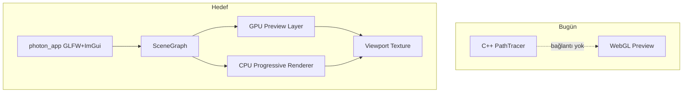
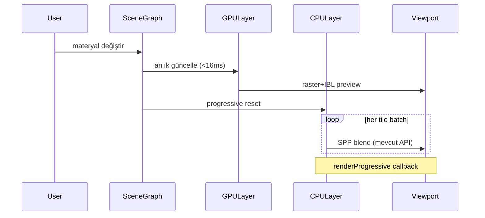

# PhotonEngine — Marmoset × KeyShot UI Yol Haritası

## Vizyon

**Hedef:** KeyShot kadar kolay, Marmoset kadar güçlü — ama ikisinin de karmaşıklığını gizleyen bir ürün görselleştirme aracı.

| Referans | Alınacak | Gizlenecek |
|----------|----------|------------|
| **KeyShot 7** | Sol kütüphane, materyal küreleri, sürükle-bırak, Studios, temiz layout | Alt workflow toolbar (Import/Library/Project ikonları) — üst menü yeterli |
| **Marmoset 3** | GGX, GI, yüksek çözünürlük gölge, gelişmiş materyal slotları | Sol paneldeki yoğun teknik ağaç, timeline (v2'ye ertelenir) |

**Kalite ilkesi:** Kullanıcı hiçbir ayar yapmadan bile iyi görüntü alır. Ayarlar "Gelişmiş" katmanında açılır.

**Kullanım ilkesi:** Her işlem sürükle-bırak veya tek tıkla yapılabilir olmalı — dosya, materyal, ortam, ışık, kamera preset'i.

---

## Mevcut Durum (Başlangıç Noktası)

PhotonEngine bugün iki ayrı dünyada yaşıyor:

- **C++ çekirdek** ([`src/engine/`](src/engine/), [`src/materials/`](src/materials/)): CPU path tracer, Disney BRDF, BVH, `renderProgressive()` API — üretim kalitesi için hazır temel
- **Web önizleme** ([`web/index.html`](web/index.html)): WebGL2 shader path tracer, basit sidebar — UI referansı ama C++ ile bağlı değil
- **Eksikler:** Native UI yok, scene graph yok, sürükle-bırak yok, glTF/OBJ pipeline tamamlanmamış, GPU backend yok, `glfw3`/`imgui` vcpkg'de tanımlı ama CMake'e bağlı değil



---

## UI Layout Tasarımı

KeyShot'un sade akışı + Marmoset'in derinliği, **progressive disclosure** ile:

```
┌─────────────────────────────────────────────────────────────────────┐
│  [Dosya] [Düzenle] [Görünüm] [Render]          [▶ Render] [Export] │  ← minimal menü
├──────────┬──────────────────────────────────────────┬───────────────┤
│          │                                          │  Sahne Ağacı  │
│ KÜTÜPHANE│                                          │  (basit tree) │
│          │                                          ├───────────────┤
│ [Materyal│           VIEWPORT                       │  İnceleyici   │
│  Ortam   │      (hero, %70 ekran)                   │  ───────────  │
│  Doku    │                                          │  Basit mod    │
│  Studio] │                                          │  [Gelişmiş ▼] │
│          │                                          │  Marmoset     │
│  küre    │                                          │  kontrolleri  │
│  grid    │                                          │               │
├──────────┴──────────────────────────────────────────┴───────────────┤
│  SPP: 128/512  │  GPU önizleme  │  ████████░░ %78  │  1920×1080   │  ← durum çubuğu
└─────────────────────────────────────────────────────────────────────┘
```

### Panel Detayları

**Sol — Kütüphane (KeyShot tarzı, sürükle kaynağı)**
- Sekmeler: Materyaller | Ortamlar | Dokular | Studios
- Ağaç kategorileri: Metalik, Plastik, Cam, Kumaş, Emissive...
- Küre thumbnail grid — her preset offline render edilmiş önizleme
- Sürükle: viewport'a materyal, HDR'ye ortam, mesh'e doku

**Orta — Viewport**
- Orbit / pan / zoom (mevcut web davranışı taşınacak)
- Hover'da parça highlight (picking)
- Drop zone overlay: "Modeli buraya bırak" (boş sahne)
- Kalite göstergesi: GPU (anlık) → Progressive (SPP artışı) geçiş animasyonu

**Sağ — Sahne + İnceleyici**
- Üst: Basitleştirilmiş sahne ağacı (mesh > alt parçalar)
- Alt: Seçili öğe özellikleri
  - **Basit mod (varsayılan):** Renk, parlaklık, metaliklik, pürüzlülük — 4 slider
  - **Gelişmiş mod (Marmoset):** Normal map, gloss map, GGX, horizon smoothing, occlusion, emissive, IOR

**Alt — Durum çubuğu**
- Progressive SPP sayacı, render ilerlemesi, çözünürlük, GPU/CPU modu

---

## Render Mimarisi (Hibrit Progressive)

İki katmanlı render — kullanıcı her zaman anlık geri bildirim görür, kalite arka planda artar:



### Katman 1 — GPU Anlık Önizleme (60 fps hedef)
- **v1:** OpenGL 4.5 + IBL + GGX PBR rasterization (hızlı, GLFW ile doğal entegrasyon)
- **v2:** Vulkan RT veya OptiX (`PHOTON_BUILD_GPU`) — gerçek zamanlı yansımalar
- Amaç: Materyal/ışık değişikliğinde <16ms geri bildirim

### Katman 2 — CPU Progressive Path Tracing (final kalite)
- Mevcut [`Renderer::renderProgressive()`](src/engine/renderer.h) doğrudan kullanılacak
- Arka plan thread pool'da tile render → viewport texture'a blend
- Parametre değişince SPP sıfırlanır, birikimli ortalama devam eder (web'deki formül: `1/(n+1)`)
- **Kalite hedefleri:** NEE, Russian roulette, Disney BRDF, HDR env, thin-lens DoF

### Katman 3 — Final Render + Denoise
- Tam çözünürlük offline render (mevcut `Renderer::render()`)
- Intel OIDN entegrasyonu (`PHOTON_ENABLE_OIDN`) — düşük SPP'de bile temiz çıktı
- PNG + EXR export

### Kalite Garantisi Kontrol Listesi
- [ ] GGX microfacet specular (Disney materyalde mevcut)
- [ ] HDR environment importance sampling (mevcut)
- [ ] Tonemapping: ACES filmic (mevcut)
- [ ] Temporal accumulation + reset on change
- [ ] OIDN denoise (planlanan)
- [ ] Texture map desteği: albedo, normal, roughness, metalness (yeni)
- [ ] Clear-coat katmanı (KeyShot tarzı, Disney genişletmesi)

---

## Alt Sistemler ve Sürükle-Bırak Haritası

Her etkileşim noktası için hedef davranış:

| Kaynak | Hedef | Aksiyon |
|--------|-------|---------|
| Dosya gezgini → viewport | Viewport | OBJ/glTF/FBX model yükle |
| HDR dosyası → viewport | Arka plan | Environment map ata |
| Materyal küresi → viewport mesh | Mesh parçası | Materyal uygula (ray pick) |
| Doku dosyası → inspector slot | Albedo/Normal/Roughness | Texture map bağla |
| Studio preset → viewport | Tüm sahne | Işık + kamera + ortam paketi |
| Kamera preset → viewport | Kamera | Açı/pozisyon değiştir |
| Sahne ağacında obje | Başka obje üstü | Parent/child ilişkisi (v1.5) |

### Picking & Drop Altyapısı
- GPU color picking pass (her mesh parçasına unique ID)
- `ImGui::GetDragDropPayload()` + custom `"PHOTON_MATERIAL"` / `"PHOTON_MODEL"` payload tipleri
- OS dosya drop: `glfwSetDropCallback`

---

## Yeni Kod Mimarisi

Mevcut modüler yapı korunur, üstüne uygulama katmanı eklenir:

```
src/
├── app/                    # YENİ — GLFW pencere, main loop
│   ├── application.cpp
│   └── main_app.cpp        # photon_app executable entry
├── ui/                     # YENİ — ImGui panelleri
│   ├── viewport_panel.cpp  # 3D viewport + input
│   ├── library_panel.cpp   # materyal/ortam kütüphanesi
│   ├── inspector_panel.cpp # basit + gelişmiş mod
│   ├── scene_tree_panel.cpp
│   ├── menubar.cpp
│   └── drag_drop.cpp       # payload + OS drop
├── scene/                  # YENİ — hiyerarşik sahne graph
│   ├── scene_node.h        # transform, children, components
│   ├── scene_graph.cpp     # flat Scene'e compile
│   └── material_library.cpp
├── preview/                # YENİ — GPU anlık önizleme
│   ├── gl_preview.cpp      # OpenGL PBR rasterizer
│   └── viewport_texture.cpp
├── engine/                 # MEVCUT — genişletilecek
├── materials/              # MEVCUT — texture map desteği eklenecek
├── io/                     # MEVCUT — glTF tamamlanacak, scene JSON
└── ...
```

**Kritik köprü:** `SceneGraph::compile()` → mevcut flat [`Scene`](src/engine/scene.h) + BVH rebuild. UI scene graph ile konuşur, renderer flat scene alır — mevcut integrator kodu bozulmaz.

---

## Faz Bazlı Yol Haritası

### Faz 0 — Temel Kabuk (3-4 hafta)
**Hedef:** Boş native pencere açılır, viewport'ta Cornell Box progressive render edilir.

- [ ] `glfw3` + `imgui` + `imgui_impl_glfw` + `imgui_impl_opengl3` CMake entegrasyonu ([`CMakeLists.txt`](CMakeLists.txt), [`vcpkg.json`](vcpkg.json))
- [ ] `photon_app` executable: GLFW window + ImGui dockable layout
- [ ] `ViewportPanel`: OpenGL texture upload, CPU `renderProgressive` çıktısını göster
- [ ] Kamera orbit/pan/zoom (web'deki mantık port edilecek)
- [ ] Durum çubuğu: SPP, FPS, çözünürlük

**Doğrulama:** Cornell Box, parametre değişince progressive reset, 60fps UI

---

### Faz 1 — Sahne Graph + Model İçe Aktarma (4-5 hafta)
**Hedef:** OBJ/glTF sürükle-bırak ile yüklenir, sahne ağacında görünür.

- [ ] `SceneNode` hiyerarşisi: Transform ([`src/core/math/transform.*`](src/core/math/transform.*) entegrasyonu), mesh ref, material ref
- [ ] `SceneGraph::compile()` → flat `Scene` + `buildAccelerator()`
- [ ] glTF loader tamamlama ([`src/io/gltf_loader.h`](src/io/gltf_loader.h) stub → gerçek implementasyon; ponytail: başta glTF 2.0 PBR subset)
- [ ] OS drag-drop: `glfwSetDropCallback` → model yükleme
- [ ] `SceneTreePanel`: seçim, görünürlük toggle, silme
- [ ] GPU picking pass: tıklayarak parça seçimi

**Doğrulama:** Harici OBJ dosyasını viewport'a sürükle → render edilir → ağaçta seçilebilir

---

### Faz 2 — Materyal Kütüphanesi + Sürükle-Bırak (4-5 hafta)
**Hedef:** KeyShot tarzı materyal küreleri, viewport'a sürükle-uygula.

- [ ] `MaterialLibrary`: JSON preset dosyaları (`assets/materials/*.json`) — metalik, plastik, cam, kumaş
- [ ] Küre thumbnail renderer: offline mini render veya GPU shader preview
- [ ] `LibraryPanel`: kategori ağacı + küre grid
- [ ] Drag-drop: materyal küresi → viewport mesh (picking ID ile hedefleme)
- [ ] `InspectorPanel` basit mod: baseColor, metallic, roughness, specular
- [ ] Texture map slotları: albedo, normal, roughness, metalness (drag-drop dosya)

**Doğrulama:** 10+ preset materyal, sürükle-bırak ile parçaya uygulama, anlık görsel değişim

---

### Faz 3 — GPU Anlık Önizleme Katmanı (3-4 hafta)
**Hedef:** Parametre değişikliğinde <16ms geri bildirim, CPU progressive arka planda devam eder.

- [ ] `GLPreview`: IBL + GGX rasterizer, environment cubemap
- [ ] Dual-layer viewport: GPU preview (düşük SPP) üstte, CPU progressive altta blend
- [ ] Parametre değişince: GPU anında, CPU SPP reset
- [ ] Performans modu toggle: "Hızlı önizleme" / "Kalite önizleme"

**Doğrulama:** Slider kaydırırken 60fps, bırakınca progressive kalite artışı

---

### Faz 4 — Ortam, Işık & Studios (3-4 hafta)
**Hedef:** HDR ortam ve ışık preset'leri sürükle-bırak.

- [ ] HDR environment drag-drop → [`EnvironmentLight`](src/lights/environment_light.h)
- [ ] Studio preset sistemi: kamera açısı + HDR + 3 nokta ışık paketi (`assets/studios/*.json`)
- [ ] `LibraryPanel` Ortamlar sekmesi: HDR thumbnail grid
- [ ] Basit ışık ekleme: area light, directional (sürükle viewport'a)
- [ ] Gelişmiş mod (Marmoset): AO strength, shadow quality, GI bounce count

**Doğrulama:** "Product Studio" preset → tek tıkla profesyonel ürün görselleştirme

---

### Faz 5 — Final Render Kalitesi (4-5 hafta)
**Hedef:** KeyShot/Marmoset seviyesinde final çıktı.

- [ ] Intel OIDN denoise entegrasyonu
- [ ] Adaptive sampling (varyans yüksek piksellere daha fazla örnek)
- [ ] Tam çözünürlük render dialog: width, height, SPP, thread count
- [ ] PNG + EXR export (mevcut I/O kullanılacak)
- [ ] Render queue: arka planda render, UI bloklanmaz
- [ ] Clear-coat materyal katmanı (KeyShot metallic paint benzeri)
- [ ] Thin-lens DoF UI (mevcut [`ThinLensCamera`](src/camera/) bağlantısı)

**Doğrulama:** 1920×1080, 256+ SPP + OIDN → photorealistic ürün render'ı

---

### Faz 6 — Cila & Profesyonel UX (3-4 hafta)
**Hedef:** Üretim kalitesinde polish.

- [ ] ImGui dark theme: KeyShot estetiği (custom style, rounded panels)
- [ ] Undo/Redo stack (materyal, transform, import)
- [ ] Proje kaydet/yükle (`.photon` JSON scene format)
- [ ] Klavye kısayolları: Ctrl+Z, Ctrl+S, F5 render, Space turntable
- [ ] Turntable animasyonu (otomatik kamera dönüşü, GIF/MP4 export)
- [ ] Tooltip'ler ve onboarding: ilk açılışta "modeli sürükle" rehberi

---

### Faz 7 — İleri Özellikler (v2, isteğe bağlı)
- Timeline / keyframe animasyon (Marmoset alt bar)
- Vulkan RT / OptiX GPU path tracer
- Web paylaşım modülü (WASM export)
- CAD formatları (STEP via OpenCascade)
- AI denoise alternatifleri

---

## Teknoloji Kararları

| Karar | Seçim | Gerekçe |
|-------|-------|---------|
| UI framework | **Dear ImGui + GLFW** | vcpkg'de hazır, C++ ekosistemiyle doğal, hızlı iterasyon |
| GPU preview v1 | **OpenGL 4.5 PBR** | GLFW ile sıfır ek bağımlılık |
| GPU preview v2 | **Vulkan RT** | `PHOTON_BUILD_GPU` flag ile opt-in |
| Scene format | **JSON (.photon)** | İnsan okunabilir, git-friendly |
| Materyal preset | **JSON + texture paths** | KeyShot .kmp benzeri basitlik |
| Thumbnail | **GPU shader ball** | Offline render'dan hızlı |
| Build | **CMake + vcpkg** | Mevcut altyapı |

---

## Riskler ve Azaltma

| Risk | Etki | Azaltma |
|------|------|---------|
| İki render katmanı senkronizasyonu | Materyal farklı görünür | Ortak Disney BRDF parametreleri, paylaşılan `MaterialLibrary` |
| ImGui ile modern UI estetiği | KeyShot kadar şık olmayabilir | Custom ImGui style + viewport hero layout |
| glTF karmaşıklığı | Import hataları | glTF 2.0 PBR subset ile başla, genişlet |
| CPU progressive yavaş | Büyük sahnelerde UX kötü | GPU preview her zaman aktif, OIDN ile düşük SPP |
| Scope creep | Proje bitmez | Faz 0-5 = MVP, Faz 6 = polish, Faz 7 = v2 |

---

## Başarı Kriterleri (MVP = Faz 0-5)

1. **Kullanım:** Sıfır eğitimle model sürükle → materyal sürükle → render → export (5 adım, 2 dakika)
2. **Kalite:** 256 SPP + OIDN ile KeyShot ürün görselleştirmesine yakın çıktı
3. **Hız:** UI 60fps, parametre değişikliği <16ms GPU geri bildirim
4. **Derinlik:** Gelişmiş modda Marmoset seviyesinde materyal kontrolü mevcut

---

## Önerilen İlk Adım

Faz 0'dan başla: [`CMakeLists.txt`](CMakeLists.txt)'e GLFW+ImGui ekle, `src/app/main_app.cpp` oluştur, mevcut `renderProgressive()` çıktısını ImGui viewport texture'ına bağla. Bu tek adım tüm yol haritasının temelini atar ve Cornell Box'ı native pencerede gösterir.
