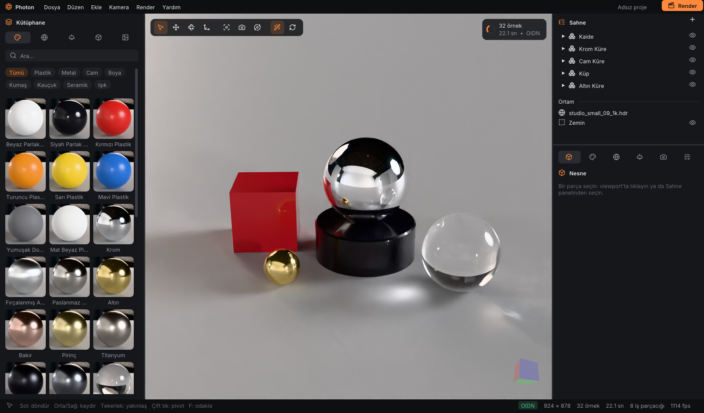

# PhotonEngine

**Ürün görselleştirme için fiziksel tabanlı render motoru ve masaüstü stüdyo.**

PhotonEngine, KeyShot tarzı bir iş akışı sunan C++20 bir yol izleyicidir (path tracer):
modeli sürükle-bırak ile içe aktar, kütüphaneden malzemeleri parçaların üzerine bırak,
bir stüdyo/HDRI seç, viewport'ta birkaç saniyede gürültüsüz önizlemeyi gör ve tek tıkla
yüksek çözünürlüklü render al. Aynı zamanda bir öğrenme projesidir: kod, bilgisayar
grafiğinin tüm hattını öğretecek biçimde Türkçe açıklamalarla yazılmıştır.



---

## Öne çıkanlar

**Render**
- Çok sekmeli yol izleme: ışık örneklemesi (NEE) + BSDF örneklemesi, MIS (güç sezgiseli), Rus ruleti.
- Owen karıştırmalı Sobol örnekleme (Burley 2020): ilerlemeli render'da hızlı yakınsama.
- Intel Embree 4 ile ışın kesişimi (yoksa motorun kendi SAH BVH'si).
- Intel Open Image Denoise (OIDN 2.5): viewport'ta etkileşim sırasında ve hedef örnekte yapay zekâ ile gürültü giderme; albedo + normal AOV'leri.
- Ton eşleme: **Khronos PBR Nötr** (ürün renkleri için), AgX, ACES, Hable; EV pozlama; sRGB + titreşimli 8-bit.

**Malzemeler**
- Disney Principled: metal, plastik, araç boyası (vernik/clear coat), anizotropi (fırçalanmış metal), kumaş parlaklığı (sheen), ince yüzey geçirgenliği, ışık yayma.
- Cam: kusursuz ve buzlu (GGX, VNDF örnekleme), kırılma indisi hazırları (su, cam, kristal, elmas).
- 37 hazır malzeme (Plastik, Metal, Cam, Boya, Kumaş, Kauçuk, Seramik, Işık); motorla render edilmiş küçük resimler.
- Dokular: taban rengi (sRGB), normal / pürüzlülük / metalik (doğrusal).

**Aydınlatma**
- HDRI ortamlar (Poly Haven, CC0) + prosedürel gökyüzleri; döndürme ve parlaklık.
- Arka plan: ortam, düz renk ya da **şeffaf** (alfa kanallı PNG).
- Otomatik sonsuz zemin (gölge ve yansıma taşır).
- Alan (softbox), güneş ve nokta ışıklar; 6 stüdyo preset'i (ışıklar sahne boyutuna ve kameraya göre yerleşir).

**Arayüz**
- Kütüphane (malzeme / ortam / stüdyo / model / doku), sahne ağacı, özellikler (nesne, malzeme, ortam, ışıklar, kamera, görüntü).
- Viewport: orbit/pan/zoom, tıkla-seç, çift tıkla pivot, ImGuizmo ile taşı/döndür/ölçekle, yön küpü, seçim çerçevesi.
- UI'ı asla bekletmeyen render thread'i; sürüklerken düşük çözünürlük + anlık OIDN (çözünürlük merdiveni).
- Geri al / yinele (tam belge anlık görüntüsü), proje dosyası (.photon, JSON), Türkçe yolları destekler.
- Son render penceresi: çözünürlük hazırları (HD → 4K, kare, dikey, A4), örnek sayısı / süre sınırı, PNG / JPEG / EXR, canlı önizleme, kalan süre, turntable kare dizisi.

---

## Derleme (Windows, MSVC)

Gerekenler: Visual Studio 2022/2026 (C++ masaüstü), CMake ≥ 3.21, Ninja (VS ile gelir).

```powershell
# 1) Bir kez: OIDN ve Embree'nin hazır paketlerini indir — third_party/
powershell -ExecutionPolicy Bypass -File scripts\fetch_deps.ps1

# 2) VS geliştirici kabuğu (VCPKG_ROOT, VS'in kendi vcpkg'sini gösterebilir)
$env:VCPKG_ROOT = "C:\Program Files\Microsoft Visual Studio\18\Community\VC\vcpkg"
. .\scripts\devshell.ps1

# 3) Yapılandır, derle, test et
cmake --preset release
cmake --build --preset release
ctest --preset release
```

glfw, Dear ImGui (docking), ImGuizmo ve nlohmann-json vcpkg ile gelir (`vcpkg.json`).

### Paketleme

```powershell
pwsh -File scripts\package.ps1   # → dist\PhotonEngine-<sürüm>-win64.zip
```

Kurulum gerektirmeyen paket: iki exe, DLL'ler, VC++ çalışma zamanı (uygulama yanına),
`assets\`, `ornekler\vitrin.photon`, `KULLANIM.txt` (kullanıcı kılavuzu, `packaging\`) ve
`lisanslar\`. Sürüm kök `CMakeLists.txt`'teki `project(VERSION)`'dan okunur.

### Çalıştırma

```powershell
build\release\src\app\photon_app.exe                 # masaüstü uygulaması (örnek sahneyle açılır)
build\release\src\app\photon_app.exe model.obj       # bir modelle aç
build\release\photon_render.exe sahne.photon --res 1920x1080 --spp 256 --out render.png
```

`photon_render` arayüzsüz render ve ölçüm aracıdır: `--threads N`, `--bounces N`,
`--no-denoise`, `--stats stats.json` (süre, Mörnek/sn).

`photon_app --screenshot cikti.png [--ui material|render|env|light|camera] [--spp 16]`
arayüzü çizip ekran görüntüsü alır ve çıkar (görsel regresyon için).

### CMake seçenekleri

| Seçenek | Varsayılan | Açıklama |
|---|---|---|
| `PHOTON_BUILD_APP` | `ON` | `photon_app` masaüstü uygulaması |
| `PHOTON_BUILD_CLI` | `ON` | `photon_render` komut satırı renderer'ı |
| `PHOTON_BUILD_TESTS` | `ON` | GoogleTest birim testleri |
| `PHOTON_ENABLE_OIDN` | `ON` | `third_party/oidn` bulunursa gürültü giderme |
| `PHOTON_ENABLE_SIMD` | `ON` | AVX2/FMA |
| `PHOTON_ENABLE_ASAN` | `OFF` | AddressSanitizer |

---

## Kullanım

1. Modeli (OBJ / glTF / GLB) pencereye sürükleyin. Zemine oturtulur, kamera kadrajlanır, varsayılan stüdyo ışıkları kurulur.
2. **Kütüphane → Malzeme**'den bir küreyi viewport'taki parçanın üzerine bırakın (ya da parçayı seçip çift tıklayın).
3. **Kütüphane → Ortam / Stüdyo** ile aydınlatmayı değiştirin. Ortamı **Özellikler → Ortam**'dan döndürün.
4. Parçayı tıklayıp **W / E / R** ile taşıyın, döndürün, ölçekleyin (Ctrl+tık ile birden çok nesne;
   Ctrl basılıyken adımlı). Sahne panelinde sürükleyerek gruplara taşıyın, **Ctrl+G** ile gruplayın,
   **H / I / Alt+H** ile gizleyin, yalnız seçimi gösterin, hepsini gösterin.
5. **Render** (Ctrl+P) → çözünürlük ve kaliteyi seçip başlatın. Çıktı varsayılan olarak `Resimler/PhotonEngine`.

Tüm kısayollar: **F1**.

---

## Kaynak düzeni

```
src/
├── core/          matematik, renk, görüntü + G/Ç, ton eşleme, RNG, örnekleme, iş parçacıkları
├── geometry/      küre, üçgen, mesh, kendi BVH'miz
├── materials/     Lambert, ayna, cam (dielectric), Disney Principled, mikro-yüzey yardımcıları
├── lights/        nokta, yönlü, alan, mesh ışığı, HDRI ortam ışığı
├── camera/        perspektif, ince mercek (alan derinliği), ortografik
├── samplers/      bağımsız, tabakalı, Owen-Sobol
├── integrators/   yol izleyici
├── io/            OBJ ve glTF yükleyiciler
├── engine/        render Scene, Renderer, Embree hızlandırıcısı, OIDN
├── scene/         sahne ağacı, malzeme kütüphanesi, ışık/ortam belgesi, stüdyolar, proje dosyası, geri al
├── ui/            tema + fontlar, ortak widget'lar, orbit kamera, dosya diyaloğu
├── app/           photon_app: render denetleyicisi, küçük resimler, paneller
└── main.cpp       photon_render
```

Ayrıntılı mimari: [`docs/architecture.md`](docs/architecture.md). Çalışma planı ve tarama bulguları:
[`memory-bank/`](memory-bank/). Üçüncü taraf lisansları: [`docs/THIRD_PARTY.md`](docs/THIRD_PARTY.md).
