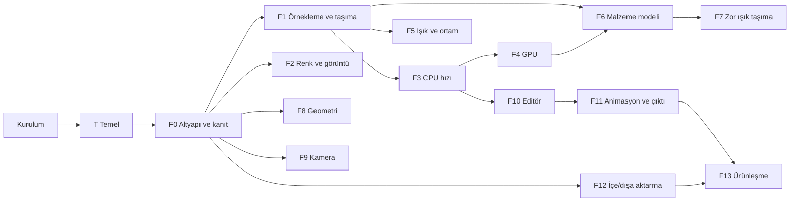
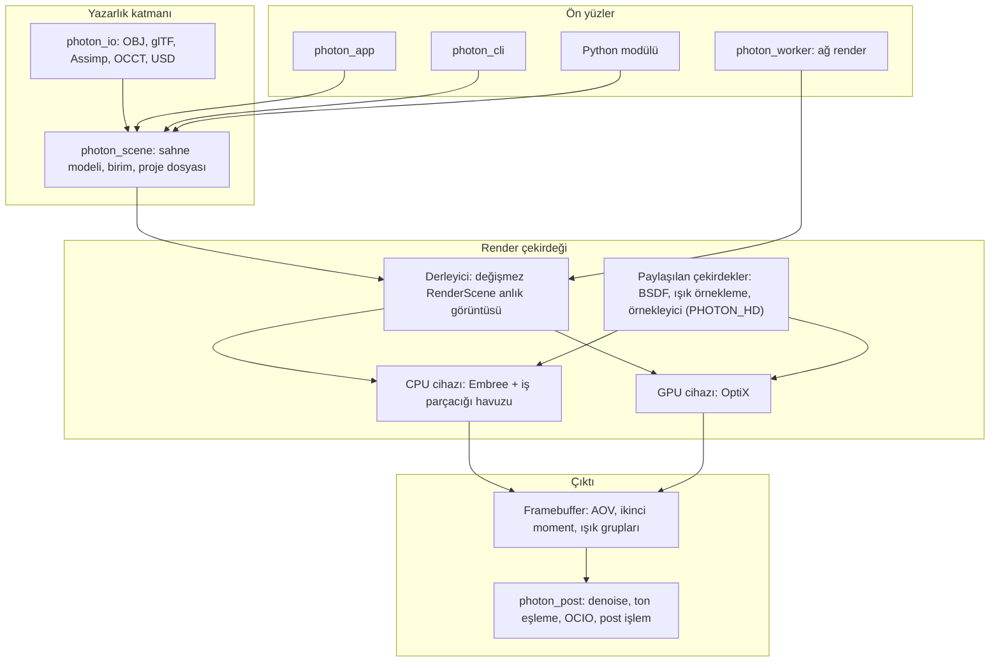

# PhotonEngine yol haritası: KeyShot ötesi

Hedef: ürün görselleştirmede KeyShot'tan daha doğru görüntü, en az onun kadar hızlı etkileşim, daha geniş malzeme ve ışık seti, eksiksiz CAD iş akışı. Karşılaştırma ölçütü KeyShot'a ek olarak V-Ray, Arnold, Cycles ve Mitsuba 3 (doğruluk referansı).

Her madde: **ne yapılır**, nerede, nasıl doğrulanır. Her faz ayrı commit dizisi. Hiçbir madde testi olmadan kapanmaz. Her faz [bench/BASELINE.md](../bench/BASELINE.md) tablosunu günceller.

## Şu anki durum

- Testler 56/56 geçiyor, `photon_app` derleniyor. 64 dosya commit edilmemiş; son commit `b686a31`.
- Uygulama bu oturumdaki değişikliklerden sonra açılmadı. GL VAO önbelleği, ImGui sürükleme ve render sırasında önizlemenin uyuması yalnız derlendi.
- Çalışan kısımlar: iki yüzlü softbox ve MIS, HDRI parlaklık CDF'si, giriş/çıkışı doğru cam ve buzlu cam, anizotropik metal, sheen, ince transmission, mesh ışıkları, mesh başına tek BVH, glTF dönüşüm ve doku, ortografik kamera, katmanlı örnekleme, HDR/EXR okuma ([src/core/image/image_io.cpp](../src/core/image/image_io.cpp)).
- Asıl eksik **kanıt**: `assets/` içinde yalnız `sample_box.gltf` var. Hiçbir render KeyShot veya bir referans motorla karşılaştırılmadı.
- Makine: **GTX 1080** (Pascal, RT çekirdeği yok; RTX gelene kadar), Visual Studio 18 Community (MSVC 14.51). CUDA ve `nvidia-smi` PATH'te yok. `cmake` yalnız VS geliştirici kabuğunda (`Launch-VsDevShell.ps1`) var.
- vcpkg kurulu (`C:\vcpkg`, `VCPKG_ROOT`), `vcpkg.json` baseline ile sabit. `build-vcpkg/` ile glfw3, glm ve imgui (docking, glfw, opengl3) vcpkg'den; `photon_app` bağlanıyor, 56/56 test geçiyor.
- vcpkg'de **olmayanlar**: OIDN, Open PGL, imnodes. Bunlar aşağıda resmi derlenmiş paketten veya sabitlenmiş FetchContent'ten alınır. Önceki `vcpkg.json` içindeki `openimagedenoise` satırı var olmayan bir paketti ve her vcpkg derlemesini kırıyordu; kaldırıldı.
- vcpkg indirmeleri bu ağda arada DNS hatası veriyor ("Could not resolve hostname"); vcpkg yedek sunucuya geçiyor, geçmezse yeniden denemek yetiyor.

## Kilometre taşları

- **M1 — KeyShot ile eşit görüntü:** T, F0, F1, F2 (ton eşleme, AOV, shadow catcher), F3 (OIDN, Embree), F6 (OpenPBR çekirdeği). Bench sahnelerinde KeyShot render'ı ile yan yana (KeyShot erişimi yoksa Blender Cycles ile), Mitsuba 3 ile sayısal fark. M1, bir kullanım testiyle kapanır (aşağıda).
- **M2 — KeyShot ile eşit hız:** F4. RTX kartta bench ürün sahnesinde yarım saniyede gürültüsüz önizleme.
- **M3 — KeyShot ötesi görüntü:** F5, F6'nın geri kalanı, F7. KeyShot'ta olmayan veya zayıf olanlar: MNEE kostik, path guiding, spektral mod, nested dielectric, OpenPBR, light groups ile sonradan ışık ayarı.
- **M4 — Ürün:** F8 ile F13. Yuvarlatılmış kenar, CAD, animasyon, ağ render, scripting, kurulum.

Ölçek: bu liste bir ekip için yıllar süren iş. Sıra etkiye göre; her madde tek başına teslim edilebilir.

---

## Kararlar

Bu üç karar planın geri kalanını belirler. Her biri T fazında `docs/adr/` altına ayrı kayıt olarak yazılır.

- **Platform: Windows ve Linux.** Linux render çiftliği ve ağ render için. macOS yok, bu yüzden Metal backend yok. Sonuçları:
  - Her commit iki platformda derlenir ve test edilir.
  - Windows'a özgü kod (dosya diyaloğu, hata kutusu) taşınabilir hale gelir.
  - CLI ve ağ render çalışanı ekransız (GL'siz) çalışır.
- **Ürün: ticari, kapalı kaynak.** Sonuçları:
  - Her bağımlılık eklenmeden önce lisansı onaylanır.
  - GPL kod hiç girmez. LGPL kütüphaneler (OpenCASCADE, ffmpeg) yalnız dinamik bağlanır.
  - Üçüncü taraf bildirimleri ürünle dağıtılır.
  - Lisans anahtarı, EULA ve kod imzalama ürünün parçası olur.
  - Ürün içinde ve tanıtımda "KeyShot" marka adı kullanılmaz; karşılaştırmalar yalnız iç belgelerde kalır.
- **GPU: RTX kart (RTX 3060 veya üstü).** GPU fazının hedefi Turing ve sonrası (sm_75+), donanım ışın kesişimiyle. Sonuçları:
  - GTX 1080, RTX gelene kadar yalnız CPU geliştirme için kullanılır; F4 RTX takılınca başlar.
  - Pascal'a özel önlemler (CUDA 12'de kalmak, OIDN'i CPU'da çalıştırmak) gerekmez.
  - Ticari üründe GPU olmayan veya NVIDIA olmayan makineler için CPU yolu her zaman tam işlevli kalır.

## Hedef mimari

297 maddenin aynı kodda dağılmadan birikmesi için hedef yapı. Bugünkü koddan yeniden yazımla değil, aşağıdaki geçiş adımlarıyla gidilir.

**Kurallar**
- **Bağımlılık yönü tek yönlü:** `core` ← `scene` ← `render` ← `post` ← ön yüzler. Bugün `photon_scene`, `photon_engine`'e bağlı ([src/scene/CMakeLists.txt](../src/scene/CMakeLists.txt)); yani sahne modeli render motorunu tanıyor. T fazında bu ters çevrilir: sahne modeli render'dan habersiz olur, render sahneyi derleyerek tüketir.
- **Sahne modeli ile render sahnesi ayrı:** UI değiştirilebilir sahne modelini düzenler. Render, derleyicinin ürettiği değişmez `RenderScene` anlık görüntüsünü kullanır. Değişiklikler "delta" olarak (malzeme parametresi, dönüşüm, topoloji) iletilir; artımlı güncelleme (F3, F4) buna dayanır.
- **Cihaz arayüzü:** `RenderDevice { upload, update(delta), renderPass, cancel }`. CPU ve GPU aynı arayüzü uygular; integratör ve malzeme matematiği iki cihazda aynı paylaşılan çekirdekten gelir.
- **Malzeme parametre olarak:** sıcak yolda sanal çağrı yok. Malzeme bir parametre bloğu (OpenPBR alanları + doku referansları); düğüm grafiği (F6) bu bloğa derlenir.
- **Proje biçimi:** yerel biçim sürümlü JSON (bugünkü `saveProject` üstüne). USD yalnız içe/dışa aktarma biçimi. USD'yi yerel biçim yapmak büyük bir bağımlılığı çekirdeğe sokar; bu karar ADR'de gerekçesiyle yazılır.
- **Hata ve günlük:** tek sonuç türü, tek günlük sistemi; modül sınırında istisna yok.

**Geçiş sırası (yeniden yazım yok)**
1. T: bağımlılık yönünü düzelt, değişmez sahne anlık görüntüsü ve tek iş parçacığı kuralı.
2. F3: Embree ile birlikte `RenderDevice` arayüzü ortaya çıkar; bugünkü `Renderer` ilk CPU cihazı olur.
3. F4: OptiX ikinci cihaz olarak eklenir; çekirdekler `PHOTON_HD` ile paylaşılır.
4. F2: post işlem `photon_post` modülüne toplanır; viewport ve dışa aktarma aynı zinciri kullanır.

## Başarı ölçütleri

İlk değerler hedeftir; F0 referans ölçümünden sonra `bench/BASELINE.md` ile kalibre edilir.

- **M1 (görüntü):**
  - Ortak malzemelerde Mitsuba 3'e göre relMSE %1'in altında.
  - Tüm BSDF'ler fırın (%1) ve chi-kare testinden geçer.
  - KeyShot (veya Cycles) ile kör karşılaştırmada üç tasarımcının çoğunluğu bizi seçer ya da fark görmez.
  - Ürün sahnesinin 4K dışa aktarımı eşit sürede referanstan düşük FLIP verir.
- **M2 (hız):**
  - RTX kartta 1080p'de ilk gürültüsüz kare yarım saniyenin altında.
  - Kamera gezinirken viewport 30 fps'nin üstünde.
  - GPU ile CPU görüntü eşleşme testi geçer.
- **M3 (öte):**
  - Kostik sahnesinde eşit sürede guiding + MNEE ile varyans en az yarıya iner.
  - Sıvılı şişe sahnesi Mitsuba ile eşleşir.
  - Işık grupları render sonrası yeniden aydınlatmayı doğru toplar.
- **M4 (ürün):**
  - 1M üçgenli STEP montajı 30 saniyenin altında açılır.
  - Temiz Windows ve Linux sanal makinesinde kurulumdan ilk render'a kadar el ile adım yok.
  - 8 saatlik oturum testinde çökme yok.

## Riskler

- **Kapasite.** Tek geliştirici ve yapay zekâ ile 297 madde. Önlem: M1 dışındaki her şey M1 bitene kadar beklemede; faz sırası kilometre taşı geçmeden değişmez.
- **İki render yolu ayrışır.** CPU ve GPU zamanla farklı görüntü üretir. Önlem: paylaşılan çekirdek ve CPU-GPU eşleşme testi; test geçmeden GPU varsayılan olmaz.
- **Malzeme modeli enerji hataları.** OpenPBR'ın çok lobu var. Önlem: chi-kare ve fırın testi her lob için zorunlu.
- **Lisans.** Ticari ürüne GPL girmesi ürünü dağıtılamaz yapar. Örnek: ffmpeg'in x264 kodlayıcısı GPL. Önlem: T'deki bağımlılık kabul kuralı; video için NVENC veya OpenH264.
- **Patent.** Bazı yöntemler (ör. ReSTIR) patent başvurusu kapsamında olabilir. Önlem: ticari sürümden önce hukuki inceleme; o maddeler "isteğe bağlı" işaretli.
- **Test varlıklarının lisansı.** Bazı Khronos örnekleri ticari olmayan lisanslı (ör. `DamagedHelmet` CC BY-NC). Önlem: bench varlıkları yalnız iç test için; ürünle dağıtılan içerik ayrıca lisanslanır.
- **RTX gecikmesi.** Kart gelene kadar F4 başlayamaz. Önlem: F4 öncesi tüm fazlar CPU üstünde ilerler; paylaşılan çekirdek hazırlığı (`PHOTON_HD`) CPU'da test edilebilir.
- **Linux ayrışması.** Yalnız Windows'ta denenen kod Linux'ta kırılır. Önlem: T'de Linux CI ilk günden.
- **Ağ ve indirmeler.** vcpkg indirmeleri bu ağda arada DNS hatası veriyor. Önlem: vcpkg ikili ve varlık önbelleği; CI'da önbellek.
- **Kapsam kayması.** Yeni fikirler M1'i geciktirir. Önlem: yeni madde önce bu belgeye ve bir faza yazılır, sonra yapılır.

## Çalışma yöntemi

**Bitti tanımı.** Bir madde ancak şunların hepsi tamamsa kapanır:
- Kod, en küçük işe yarayan değişiklik ve çevresindeki kodun üslubuyla.
- En az bir test; testin eski davranışta başarısız olduğu görülmüş.
- Windows ve Linux CI yeşil.
- Görüntüyü etkiliyorsa bench yeniden çalıştırılmış, `BASELINE.md` güncellenmiş.
- Büyük kararsa ADR yazılmış; yeni bağımlılıksa lisansı `docs/THIRD_PARTY.md` içinde.
- `CHANGELOG.md` satırı; bu belgede kutusu işaretli.

**Akış.** Faz başına dal. Her madde ayrı commit. Faz sonunda bench, inceleme, ana dala birleştirme.

## Tahmini süre

Tek geliştirici, tam zaman, yapay zekâ desteğiyle kaba tahmin. T ve F0 bittikten sonra gerçek hıza göre yeniden hesaplanır.

| Faz | Hafta |
|---|---|
| T Temel | 3 – 4 |
| F0 Altyapı ve kanıt | 2 – 3 |
| F1 Örnekleme | 4 – 6 |
| F2 Renk ve görüntü | 3 – 5 |
| F3 CPU hızı | 3 – 4 |
| F4 GPU | 8 – 12 |
| F5 Işık | 4 – 6 |
| F6 Malzeme | 10 – 16 |
| F7 Zor ışık | 6 – 10 |
| F8 Geometri | 4 – 6 |
| F9 Kamera | 2 – 4 |
| F10 Editör | 8 – 12 |
| F11 Animasyon | 5 – 8 |
| F12 İçe aktarma | 6 – 10 |
| F13 Ürünleşme ve ticari dağıtım | 5 – 8 |
| **Toplam** | **73 – 114** |

M1 kabaca 25 – 35. haftada.

## İlk adımlar (sırayla)

1. Baz commit (kullanıcı).
2. T: el ile duman testi; bulunan hatalar T'ye eklenir.
3. T: `CMakePresets.json` ve `scripts/devshell.ps1`.
4. T: `stb` ve yedek imgui sabitleme, tek kaynak kuralı.
5. T: bağımlılık kabul kuralı ve `docs/THIRD_PARTY.md` (ticari karar gereği ilk sırada).
6. T: Linux derlemesi: taşınabilir dosya diyaloğu ve hata kutusu, Linux CI.
7. T: iki uyarıyı düzelt, `/W4 /WX`.
8. T: `photon_scene` → `photon_engine` bağımlılığını ters çevir, modül kuralını CMake'te zorunlu yap.
9. T: değişmez sahne anlık görüntüsü ve stres testi.
10. T: metre birimi ve ölçek testi.
11. T: okuyucu sınırları, bozuk dosya fixture'ları, fuzz.
12. T: determinizm testi, belge düzeltme, ADR'ler.
13. F0: bench varlıkları, sahneler, CLI, Mitsuba referansı.

---

## Kurulum (kullanıcı)

- [ ] **Baz commit.** `git add -A; git commit -m "lighting, materials, BVH, import"`.
- [x] **vcpkg.** `C:\vcpkg` kuruldu, `VCPKG_ROOT` ayarlandı, `vcpkg.json` baseline ile sabitlendi. Configure: `-DCMAKE_TOOLCHAIN_FILE=C:\vcpkg\scripts\buildsystems\vcpkg.cmake` (T'deki `CMakePresets.json` bunu tek komuta indirir).
- [ ] **RTX kart.** RTX 3060 veya üstü; F4 bu kart takılınca başlar.
- [ ] **CUDA ve OptiX (RTX ile).** Kartın desteklediği güncel CUDA Toolkit ve OptiX SDK (NVIDIA geliştirici hesabı), güncel sürücü. Sürümler ADR'de sabitlenir. GTX 1080 takılı kaldığı sürece CUDA 13 kurulmaz (Pascal'ı desteklemez).
- [ ] **Linux makinesi.** Fiziksel makine veya WSL2 + ayrı bir Linux sanal makinesi; GL'li uygulama testi için gerçek ekranlı ortam.
- [ ] **Python 3.11.** Bench karşılaştırması ve Mitsuba 3 referansı için: `pip install mitsuba flip-evaluator numpy imageio`.
- [ ] **KeyShot referansı (isteğe bağlı ama M1 için gerekli).** Bench sahnelerini aynı kamera, HDRI ve çözünürlükte KeyShot'ta render edip `bench/keyshot/` altına koy. Lisans yoksa T'deki Cycles referansı kullanılır.
- [ ] **Uzak depo ve CI.** Repoyu GitHub'a (veya Origin'e) koy; F0'daki CI orada çalışır.
- [ ] **Blender 4.x.** Cycles referans render'ları için (ücretsiz).

---

## T — Temel

Amaç: üstüne geri kalan 250'yi aşkın madde inşa edilecek zemini sağlamlaştırmak. Bu faz bitmeden F0 bench sahneleri yazılmaz, çünkü birim ve iş parçacığı kuralları sahneleri ve testleri etkiler.

**Çalıştığını görmek**
- [ ] **El ile duman testi.** Uygulamayı aç; Cornell ve ürün sahnesini render et; ekran görüntüsü `docs/screenshots/` altına. GL VAO önbelleği (sahne yeniden kurulunca çökme yok), inceleyicide konum sürükleme (dönüş korunur), tam render sırasında önizlemenin durması, denoise açıkken örnek sayacı el ile doğrulanır. Bulunan her hata buraya madde olarak eklenir.
- [ ] **Otomatik duman testi.** `photon_app --smoke`: gizli pencere, ürün sahnesini yükle, 16 SPP render, PNG yaz, sıfır çıkış koduyla kapan. CI'da GL varsa çalışır.

**Gerçek dünya ölçeği**
- [ ] **Tek birim: metre.** `SceneGraph` ve proje dosyasında `unitScale`; Cornell 5.55 m'ye ölçeklenir; `addAreaLight`, kamera yarıçapı, odak, yakın/uzak düzlem, ışın ofseti ve `outdoor_hdri.json`/`product_studio.json` metre varsayılanlarına. İçe aktarmada birim F12'deki diyalogla bağlanır.
- [ ] **Ölçek testi.** Aynı sahne 0.01 ve 100 katı ölçekte render edilir; görüntü relMSE eşiği içinde aynı. Gölge aknesi ve ışık sızıntısı yok.

**Güvenli dosya okuma (güven sınırı)**
- [ ] **Okuyucu sınırları.** [src/io/obj_loader.cpp](../src/io/obj_loader.cpp), [src/io/gltf_loader.cpp](../src/io/gltf_loader.cpp), [src/core/image/image_io.cpp](../src/core/image/image_io.cpp), proje JSON okuyucusu: dosya boyutu, köşe ve üçgen sayısı, doku çözünürlüğü üst sınırı; her indeks sınır kontrolünden geçer; hata mesajı döner, çökme yok.
- [ ] **Fuzz testleri.** Her okuyucu için fuzz hedefi (`tests/fuzz/`): Windows'ta MSVC `/fsanitize=fuzzer,address`, Linux'ta Clang libFuzzer; CI'da her gece 10 dakika.
- [ ] **Bozuk dosya fixture'ları.** `tests/fixtures/corrupt/`: kesilmiş, sıfır boyutlu, devasa indeksli, NaN içeren dosyalar; her biri hata mesajıyla reddedilir.

**Tekrarlanabilir derleme**
- [ ] **`CMakePresets.json`.** `dev`, `release`, `asan` ön ayarları: Ninja, vcpkg toolchain, `build/<preset>`. `cmake --preset release` tek komut; IDE ve CI aynı ayarı kullanır.
- [ ] **Geliştirici kabuğu betiği.** `scripts/devshell.ps1`: `vswhere` ile VS'i bulur, `Launch-VsDevShell.ps1` çalıştırır, `VCPKG_ROOT` kontrol eder. Bugün `cmake` düz PowerShell'de bulunamıyor.
- [ ] **Bağımlılıkları sabitle.** [CMakeLists.txt](../CMakeLists.txt) içinde `stb` `master` dalına, yedek imgui `docking` dalına bağlı; ikisi de commit hash'ine sabitlenir. Diğer FetchContent etiketleri (tinyobjloader, tinyexr, cgltf, googletest) zaten sabit.
- [ ] **Tek kaynak kuralı.** Her bağımlılık tek yoldan gelir: vcpkg'de varsa vcpkg, yoksa sabitlenmiş FetchContent veya `third_party/` altındaki resmi derlenmiş paket. `find_package` başarısız olunca sessizce başka sürüme düşen yedek yollar kaldırılır.
- [ ] **İkili önbellek.** vcpkg binary cache CI'da da açık; aynı baseline ile derlenmiş paket yeniden derlenmez.

**Linux**
- [ ] **Taşınabilir dosya diyaloğu.** [src/ui/file_dialog.cpp](../src/ui/file_dialog.cpp) yalnız Windows'ta (`GetOpenFileNameA`); vcpkg `nativefiledialog-extended` (Zlib) ile iki platformda aynı kod.
- [ ] **Taşınabilir hata kutusu.** [src/app/main_app.cpp](../src/app/main_app.cpp) `MessageBoxA` kullanıyor; aynı kütüphanenin mesaj kutusuna veya günlük + stderr'e geçer.
- [ ] **Linux derlemesi.** GCC 13+ ve Clang 17+, vcpkg `x64-linux` triplet'i, `CMakePresets.json` içinde `linux-release` ve `linux-asan`.
- [ ] **Linux CI.** Her push'ta Ubuntu LTS'de derleme ve testler; Windows ile aynı test paketi.
- [ ] **Ekransız CLI.** `photon_cli` GL ve GLFW'ye bağlanmaz; Linux sunucuda ekransız render.
- [ ] **ThreadSanitizer.** Linux'ta Clang TSan ile iş parçacığı stres testi (MSVC'de TSan yok).
- [ ] **libFuzzer.** Linux'ta Clang libFuzzer ile fuzz hedefleri; Windows MSVC fuzzer ile aynı hedefler.

**Ticari temel**
- [ ] **Bağımlılık kabul kuralı.** Yeni bağımlılık eklenmeden önce `docs/THIRD_PARTY.md` içine ad, sürüm, lisans, bağlama biçimi (statik veya dinamik) ve ticari dağıtım koşulu yazılır. GPL yasak; LGPL yalnız dinamik. CI, `vcpkg.json` ve FetchContent listesiyle bu dosyayı karşılaştırır, eksik giriş derlemeyi kırar.
- [ ] **Mevcut bağımlılıkların denetimi.** stb, tinyobjloader, tinyexr, cgltf, googletest, glfw3, glm, imgui `THIRD_PARTY.md` içine.
- [ ] **Bench varlık lisansları.** Her bench varlığının lisansı `bench/LICENSES.md` içinde; ticari olmayan lisanslılar (ör. `DamagedHelmet`) "yalnız iç test" diye işaretli ve kurulum paketine girmez.
- [ ] **Marka kuralı.** Kodda, arayüzde ve ürün içeriğinde "KeyShot" adı geçmez (bu yol haritası ve iç bench raporları hariç).

**Kod tabanı kuralları**
- [ ] **Uyarılar hata.** Motor kütüphanelerinde `/W4 /WX` (üçüncü taraf kodu hariç). Bugünkü derlemede bilinen iki uyarı önce düzeltilir: [src/core/random/rng.h](../src/core/random/rng.h) satır 23 C4146 (işaretsiz tipe eksi) ve [src/materials/material.h](../src/materials/material.h) satır 39 C4100 (kullanılmayan `si`).
- [ ] **Biçim ve statik analiz.** `.clang-format` ve `.clang-tidy`; CI'da kontrol. MSVC `/analyze` gece.
- [ ] **Sahne modelini render'dan ayır.** [src/scene/CMakeLists.txt](../src/scene/CMakeLists.txt) bugün `photon_scene`'i `photon_engine`'e bağlıyor. `SceneGraph::compile` sahne modülünden render tarafına (derleyici) taşınır; `photon_scene` yalnız `photon_core`'a bağlı kalır.
- [ ] **Modül bağımlılık kuralı.** Hedef mimarideki yön (`core` ← `scene` ← `render` ← `post` ← ön yüzler) CMake'te bir izin listesiyle zorunlu; ihlal derlemeyi kırar.
- [ ] **Hata işleme politikası.** Yükleyiciler ve dosya yazıcıları tek bir sonuç türü döner (değer veya hata mesajı); istisnalar modül sınırını geçmez; dışa aktarma yarım dosya bırakmaz (geçici dosyaya yaz, sonra taşı).
- [ ] **İş parçacığı modeli.** UI ile render arasında sahne erişimi için tek kural: render, derlenmiş sahnenin değişmez bir kopyasını (`shared_ptr<const Scene>`) kullanır; UI yeni sahneyi derleyip atomik olarak değiştirir. Kilit dağınık değil, tek yerde.
- [ ] **İş parçacığı stres testi.** Render sürerken 1000 kez malzeme, dönüşüm ve sahne değiştirme; çökme ve veri yarışı yok (AddressSanitizer açık).
- [ ] **Determinizm.** Aynı seed ile görüntü, iş parçacığı sayısından bağımsız bit bit aynı; test 1, 4 ve 16 iş parçacığıyla.

**Belgeler ve süreç**
- [ ] **Eski belgeleri düzelt.** [docs/architecture.md](architecture.md) ve [docs/file-reference.md](file-reference.md) koda göre yeniden yazılır; olmayan özellikler (Halton, OptiX, ayrı integratörler, `src/gpu`) çıkarılır.
- [ ] **Mimari karar kayıtları.** `docs/adr/`: her büyük seçim (metre, OpenPBR, Embree, OptiX, iş parçacığı modeli, hata politikası) için tek sayfa: bağlam, karar, sonuç.
- [ ] **Sürümleme.** Semver ve `CHANGELOG.md`; proje dosyası biçim sürümü uygulama sürümünden ayrı.
- [ ] **Dal ve birleştirme kuralı.** Her faz ayrı dal; CI yeşil olmadan ana dala birleşmez.
- [ ] **Cycles referansı.** KeyShot yoksa ikinci görsel referans: bench sahnelerinin Blender Cycles karşılığı (`bench/cycles/`), aynı HDRI ve kamera.

---

## F0 — Altyapı ve kanıt

Amaç: her sonraki değişikliği sayı ve görüntüyle ölçmek. Bu faz olmadan "daha iyi" iddiası yapılamaz.

- [ ] **Varlıklar: HDRI.** `bench/hdri/`: Poly Haven CC0 stüdyo (`studio_small_09`), dış mekân (`kloofendal_48d_partly_cloudy`), iç mekân (`brown_photostudio_02`), 2K ve 4K `.hdr`.
- [ ] **Varlıklar: modeller.** `bench/models/`: Khronos glTF örnekleri `ToyCar`, `MaterialsVariantsShoe`, `DamagedHelmet`, `GlassVaseFlowers`, `SheenChair`, `IridescenceLamp`, `TransmissionTest`, `ClearCoatTest`, `DragonAttenuation`. `bench/LICENSES.md`. Lisansları tek tek farklı (ör. `DamagedHelmet` CC BY-NC); hepsi yalnız iç test içindir, ürünle dağıtılmaz.
- [ ] **Bench sahneleri.** `bench/scenes/` altında `saveProject` biçiminde 10 proje: krom küre + softbox; cam şişe + kostik zemin; sıvılı şişe; plastik ürün + zemin; kumaş sandalye; araba boyalı oyuncak araba; altın yüzük + pırlanta; mat siyah elektronik ürün; iç mekân; 1M üçgenli yoğun sahne. Kamera, ışık, çözünürlük sabit.
- [ ] **Sahne yükleme motora.** `Application::applyProjectFile` içindeki pencere gerektirmeyen kısım `photon_engine` tarafında `loadProject(path) -> SceneGraph + Camera + RenderSettings` olarak; uygulama ve CLI aynı fonksiyonu çağırır. Test: kaydet → yükle → kaydet aynı JSON.
- [ ] **CLI argümanları.** [src/main.cpp](../src/main.cpp): `--scene --spp --time --res WxH --out --seed --threads --denoise`. Varsayılan derlemede açık (`PHOTON_BUILD_CLI=ON`).
- [ ] **CLI istatistikleri.** PNG + EXR + `stats.json`: süre, SPP, ışın/saniye, bellek tepe değeri, ortalama piksel varyansı.
- [ ] **Bench betiği.** `bench/run.ps1`: tüm sahneler `bench/out/<tarih>/` altına; önceki çalıştırmayla süre ve varyans farkı.
- [ ] **Görüntü karşılaştırma.** `bench/compare.py`: relMSE, SSIM, NVIDIA FLIP; fark ısı haritası PNG.
- [ ] **Mitsuba 3 referansı.** `bench/mitsuba/` aynı sahnelerin Mitsuba XML karşılığı (yalnız ortak malzemeler: difüz, iletken, dielektrik, pürüzlü dielektrik), 16384 SPP. Bizim render ile relMSE eşiği.
- [ ] **Görüntü regresyon testleri.** 128×128, 256 SPP, sabit seed; `tests/golden/` altındaki görüntüyle relMSE eşiği. Bir malzeme veya integratör değişikliği bunu bozarsa görülür.
- [ ] **Beyaz fırın: Lambertian.** `tests/test_furnace.cpp`, düzgün beyaz ortam, beyaz Lambertian yaklaşık 1 (1% tolerans).
- [ ] **Beyaz fırın: Disney.** Metal ve dielektrik, pürüzlülük 0 ile 1; 1'i aşmasın. Pürüzlü metal kaybı kaydedilir (F1 Kulla-Conty için).
- [ ] **Beyaz fırın: cam.** Dielectric ve buzlu cam, yansıma + iletim yaklaşık 1.
- [ ] **Chi-kare BSDF testi.** Her BSDF için `sample` histogramı ile `pdf` integralinin chi-kare testi (Mitsuba yöntemi). `sample` ile `pdf` tutarsızsa MIS sessizce yanlış olur; bu testsiz hiçbir yeni lob eklenmez.
- [ ] **Karşılıklılık ve pozitiflik testi.** Her BSDF için `eval(wo, wi) == eval(wi, wo)` (iletim hariç, eta düzeltmesiyle), `eval >= 0`, `pdf >= 0`.
- [ ] **Referans render'lar.** Her bench sahnesi 4096 SPP; `bench/BASELINE.md`: süre, ışın/saniye, 64 SPP varyansı, Mitsuba relMSE.
- [ ] **Günlük sistemi.** Seviyeli günlük (hata, uyarı, bilgi, ayrıntı), dosyaya ve UI konsoluna. `std::cout` çağrıları buna taşınır.
- [ ] **CI.** Windows derleme + `photon_tests` + görüntü regresyonu her push'ta. Bench yalnız gece.
- [ ] **Hata ayıklama derlemesi.** MSVC AddressSanitizer ile testler; bellek hataları CI'da yakalanır.

## F1 — Örnekleme ve ışık taşıma çekirdeği

Amaç: aynı SPP'de daha az gürültü, enerji kaybı olmadan.

- [ ] **Owen karıştırmalı Sobol.** [src/samplers/](../src/samplers/) altında Burley 2020 "Practical Hash-based Owen Scrambling". Üretim örnekleyicisi olur; `StratifiedSampler` yedek.
- [ ] **Mavi gürültü dağılımı.** Piksel başına seed karıştırma (Heitz-Belcour); düşük SPP'de gürültü beyaz değil mavi, denoise daha iyi çalışır.
- [ ] **Örnekleyici yakınsama testi.** Bilinen integral (ör. aydınlatılmış difüz düzlem) eşit SPP'de Sobol hatası Independent'tan düşük.
- [ ] **Kulla-Conty enerji telafisi.** GGX çoklu saçılma için önceden hesaplanmış `E(mu, roughness)` ve `E_avg` tabloları; metal ve dielektrik lobuna telafi terimi. Pürüzlü krom kararmaz.
- [ ] **Telafi sonrası fırın testi.** Beyaz pürüzlü metal her pürüzlülükte yaklaşık 1.
- [ ] **Işık ağacı.** Işıklar üzerinde güç ve yön konisine göre BVH (Conty-Kulla 2018); NEE rastgele ışık seçimi yerine ağaçtan. Yüzlerce ışıklı sahnede gürültü düşer.
- [ ] **Işık seçimi testi.** İki ışıktan güçlü olan güç oranında seçilir; ağaç pdf'i ile seçilen ışık tutarlı.
- [ ] **Küresel dikdörtgen örnekleme.** Dikdörtgen alan ışığı için katı açı örnekleme (Ureña 2013). Yakın softbox gürültüsü düşer.
- [ ] **Küresel üçgen örnekleme.** Mesh ışıkları için katı açı üçgen örnekleme (Arvo).
- [ ] **Işın diferansiyelleri.** Kameradan ve speküler sekmelerden; doku filtreleme ve bump için.
- [ ] **Mipmap ve doku filtreleme.** Dokular için mip zinciri, diferansiyelden trilinear veya EWA. Uzaktaki etiket ve kumaş aliasing yapmaz.
- [ ] **Sağlam kendinden kesişim önleme.** Sabit epsilon yerine Wächter-Binder (Ray Tracing Gems ch.6) ofseti; büyük ve küçük ölçekli sahnelerde gölge akne ve ışık sızıntısı yok.
- [ ] **Lob başına sekme sınırları.** Difüz, parlak, iletim, hacim için ayrı maksimum derinlik (Cycles gibi). Cam ve sıvıda varsayılan yüksek.
- [ ] **Rus ruleti.** Throughput'un en büyük bileşenine göre, minimum derinlik ayarlanabilir; enerji testleri değişmez.
- [ ] **Adaptif örnekleme.** [src/engine/renderer.cpp](../src/engine/renderer.cpp) karo başına ikinci moment; göreli hata eşiği altındaki karo durur, minimum 16 SPP, UI'de eşik.
- [ ] **Adaptif örnekleme testi.** Düz renkli karo erken durur, gürültülü karo devam eder; sonuç ortalaması değişmez.
- [ ] **Firefly kelepçesi.** Dolaylı katkıya kapatılabilir kelepçe, varsayılan kapalı.
- [ ] **Path regularization.** Difüzden sonraki çok düzgün yüzeyi biraz pürüzlü say; kapatılabilir, kostik modunda kapalı.

## F2 — Renk ve görüntü pipeline'ı

Amaç: ürün rengini ekrana ve dosyaya doğru taşımak; KeyShot'un "Image" sekmesinin tamamı ve ötesi.

- [ ] **Çalışma renk uzayı.** Doğrusal Rec.709 (varsayılan) veya ACEScg seçimi; tüm malzeme ve ışık renkleri seçili uzaya bir kez dönüştürülür.
- [ ] **OpenColorIO.** vcpkg `opencolorio`; görüntüleme dönüşümleri sRGB, Display P3, Rec.2020. Viewport monitör profiline göre.
- [ ] **Doku renk uzayı.** Renk dokuları sRGB'den doğrusala, normal/roughness/metallic dokuları ham. glTF ve preset yolunda doğrulanır. Test: sRGB 0.5 dokusu doğrusal 0.214 okunur.
- [ ] **PBR Neutral.** [src/core/image/tone_mapping.cpp](../src/core/image/tone_mapping.cpp) `ToneMapOperator` enum'una; UI seçeneği. Ürün rengi olduğu gibi kalır.
- [ ] **AgX.** Doymuş ışıkta renk kayması yok.
- [ ] **Ton eşleme testleri.** Orta gri ve beyaz noktası her operatörde beklenen değerde; viewport ve dışa aktarma aynı sonucu verir.
- [ ] **Fiziksel pozlama.** EV, ya da F9'daki f-stop + enstantane + ISO'dan hesaplanan pozlama.
- [ ] **Beyaz dengesi.** Kelvin ve renk tonu; Bradford dönüşümü.
- [ ] **Bloom ve glare.** HDR üzerinde çok ölçekli Gauss bloom ve yıldız glare (diyafram bıçağı sayısıyla).
- [ ] **Vinyet ve renk sapması.** Post işlem olarak, ayarlanabilir.
- [ ] **Eğriler, kontrast, doygunluk, LUT.** `.cube` LUT okuma; tüm post işlemler yıkıcı değil, birikim tamponu değişmez.
- [ ] **AOV'ler.** Albedo, normal, derinlik, konum, nesne ID, malzeme ID, UV, gölge, AO.
- [ ] **Işık yolu geçişleri.** Doğrudan/dolaylı × difüz/parlak/iletim/hacim/emisyon ayrı tamponlar; toplamı güzellik geçişine eşit (test).
- [ ] **Işık grupları.** Işık veya ışık grubu başına ayrı tampon; render bittikten sonra her grubun parlaklığı ve rengi yeniden render etmeden değişir. KeyShot'ta bu yok.
- [ ] **Cryptomatte.** Nesne ve malzeme Cryptomatte katmanları EXR'de; Nuke ve Fusion ile uyumlu.
- [ ] **Shadow catcher.** [src/scene/scene_graph.cpp](../src/scene/scene_graph.cpp) zemini `shadowCatcher` bayrağı; gölge ve yansıma yakalanır, arka plan görünür.
- [ ] **Alfa.** Premultiplied alfa; arka plansız ürün + zemin gölgesi.
- [ ] **Çok katmanlı EXR.** Tüm AOV, ışık grubu ve Cryptomatte tek dosyada (tinyexr katman desteği).
- [ ] **16 bit PNG ve TIFF, ICC profili.** Display P3 ve Adobe RGB çıktısında gömülü ICC.

## F3 — CPU performansı

- [ ] **OIDN.** vcpkg'de yok. Intel'in GitHub sürümlerindeki derlenmiş Windows paketi (`oidn-2.x.x.x64.windows.zip`) `third_party/oidn/` altına, SHA-256 ile doğrulanarak indirilir; `CMAKE_PREFIX_PATH` ile [CMakeLists.txt](../CMakeLists.txt) `find_package(OpenImageDenoise)` bulur, `PHOTON_OIDN_FOUND`. DLL'ler `photon_app.exe` yanına kopyalanır. [src/engine/denoiser.cpp](../src/engine/denoiser.cpp) albedo ve normal ile.
- [ ] **Yanlış OIDN yönergelerini düzelt.** [src/app/application.cpp](../src/app/application.cpp) satır 1786 kullanıcıya "vcpkg: openimagedenoise" diyor, [README.md](../README.md) de aynı şeyi söylüyor; ikisi de gerçek kurulum yoluna çevrilir.
- [ ] **OIDN ön filtreleme.** Albedo ve normal ayrıca denoise edilir (`cleanAux`); ince dokularda detay korunur.
- [ ] **OIDN canlı önizleme.** `denoiseCopy` ayrı iş parçacığında; birikim bozulmaz. GTX 1080'de OIDN CPU'da çalışır (GPU modu Pascal'ı desteklemez); RTX geldiğinde OIDN'in CUDA cihazı F4'te açılır.
- [ ] **Embree 4.** `vcpkg.json` içine `embree`, `PHOTON_USE_EMBREE`. Mesh başına `rtcNewGeometry(RTC_GEOMETRY_TYPE_TRIANGLE)`. [src/geometry/bvh.cpp](../src/geometry/bvh.cpp) yedek ve test referansı; aynı ışınlarda `t` ve normal eşit.
- [ ] **Embree ölçümü.** Bench'te eski BVH ile karşılaştırma; tutmazsa bayrak kapalı.
- [ ] **Örnekleme (instancing).** Embree instance ve `SceneGraph` örnek düğümü; aynı mesh tek kopya bellekte. 1000 vida bir vida kadar bellek.
- [ ] **İş çalan iş parçacığı havuzu.** Karo zamanlayıcısı atomik sayaç ve iş çalma; UI iş parçacığı render beklemez.
- [ ] **Karo sırası.** Ortadan dışa spiral; kullanıcı ürünü önce görür.
- [ ] **Önizleme kademeleri.** Kamera hareket ederken 1/4 çözünürlük ve 1 SPP, durunca tam çözünürlük.
- [ ] **Artımlı sahne güncellemesi.** Malzeme parametresi değişince BVH yeniden kurulmaz; dönüşüm değişince yalnız üst seviye yeniden kurulur. Test: malzeme değişikliği sonrası ilk karenin süresi.
- [ ] **Doku önbelleği.** Döşemeli mipmap dokular, bellek bütçesi, LRU; 8K doku setleri belleği taşırmaz.
- [ ] **Sıcak yolda ayırma yok.** Profil ile kesişim ve gölgelemede `shared_ptr` kopyası ve heap ayırması sıfırlanır.
- [ ] **Profil.** VS profiler ile her bench sahnesinde ilk 3 sıcak nokta; ölçülen, tahmin edilen değil.
- [ ] **Mesh sıkıştırma.** İsteğe bağlı oktahedral normal ve 16 bit UV; büyük CAD montajlarında bellek yarıya iner.
- [ ] **Performans regresyon eşiği.** Gece bench'inde ışın/saniye %5'ten fazla düşerse CI uyarır.

## F4 — GPU (RTX, CUDA/OptiX)

Hedef: Turing ve sonrası (sm_75+), donanım ışın kesişimi. RTX kart takılınca başlar. GPU'su olmayan veya NVIDIA olmayan kullanıcı için CPU cihazı tam işlevli kalır.

- [ ] **Asgari sistem gereksinimi.** Desteklenen en eski GPU (RTX 20 serisi), sürücü sürümü ve VRAM `docs/SYSTEM_REQUIREMENTS.md` içinde; uygulama açılışta denetler, desteklenmeyen kartta CPU cihazına geçer ve nedenini söyler.

- [ ] **`PHOTON_HD` makrosu.** CUDA'da `__host__ __device__`, CPU'da boş; [src/core/math/](../src/core/math/), `Color3f`, örnekleyiciler, Fresnel.
- [ ] **Paylaşılan malzeme çekirdeği.** [src/materials/](../src/materials/) `eval`/`sample`/`pdf` düz `MaterialParams` üzerinde, sanal çağrısız; CPU sınıfları bunu çağırır. İki kopya yok.
- [ ] **Paylaşılan ışık örnekleme.** Işık ağacı, ortam CDF'si, küresel dikdörtgen örnekleme aynı kod.
- [ ] **CMake.** `PHOTON_BUILD_GPU=ON`: `enable_language(CUDA)`, `OptiX_INSTALL_DIR`; bulunamazsa uyarı, kırılma yok.
- [ ] **Sahne yükleme.** `SceneGraph::compile` çıktısı düz tamponlara: vertex, index, malzeme, ışık, ortam ve CDF, dokular.
- [ ] **Artımlı GPU güncellemesi.** Malzeme parametresi tampon güncellemesi; dönüşüm IAS güncellemesi; tam yükleme yok.
- [ ] **OptiX programları.** `src/gpu/`: raygen, closest-hit, miss, gölge any-hit; GAS mesh başına, IAS örnekler için.
- [ ] **GPU path tracer.** CPU ile aynı NEE, MIS, Rus ruleti ve Sobol dizisi.
- [ ] **GPU dokuları.** Mipmap'li CUDA texture objeleri, sRGB çözme donanımda.
- [ ] **VRAM bütçesi.** Kartın VRAM'i çalışma anında okunur. Yüklemeden önce sahne, BVH ve doku boyutu hesaplanır; bütçe aşılırsa dokular otomatik küçültülür ve kullanıcıya söylenir; yine aşılırsa render CPU'ya düşer. Sessiz çökme yok.
- [ ] **VRAM testi.** Bütçeyi aşan sentetik sahne GPU'da çökmeden CPU'ya düşer veya küçültülmüş dokuyla render edilir.
- [ ] **GPU denoise.** OIDN CUDA cihazı (CPU ile aynı model, aynı görüntü) varsayılan; OptiX denoiser karşılaştırılır, eşit sürede daha iyiyse seçenek olarak eklenir.
- [ ] **Viewport.** CUDA-GL interop ile doğrudan dokuya; [src/preview/gl_preview.cpp](../src/preview/gl_preview.cpp) GPU yoksa yedek.
- [ ] **CPU-GPU eşleşme testi.** Bench sahnelerinde eşit SPP'de ortalama fark gürültü standart sapmasının altında. Bu geçmeden GPU varsayılan olmaz.
- [ ] **GPU bench.** Işın/saniye, ilk temiz kareye süre, bellek; `BASELINE.md`.
- [ ] **Wavefront integratör.** Megakernel ölçüldükten sonra, malzeme dallanması darboğazsa, ışın sıralı wavefront.
- [ ] **Hibrit render.** Son render'da CPU ve GPU aynı anda farklı karolarda.
- [ ] **Çoklu GPU.** Karo veya kare bölüşümü; ikinci kart takılırsa.
- [ ] **ReSTIR DI (isteğe bağlı).** Etkileşimli viewport'ta çok ışıklı sahneler için; yanlı olduğu için son render'da kapalı.

- [ ] **Linux GPU.** OptiX ve CUDA Linux'ta aynı kodla; Linux çalışanında (`photon_worker`) GPU render.

## F5 — Işık ve ortam

- [ ] **Spot ışık.** Koni açısı, yumuşak kenar, [src/lights/point_light.cpp](../src/lights/point_light.cpp) yanında.
- [ ] **Disk, küre ve silindir alan ışıkları.** KeyShot'un ışık şekilleri; her biri için katı açı örnekleme.
- [ ] **Dokulu alan ışığı.** Softbox gradyanı, şerit ışık deseni; dokuya göre önem örneklemesi.
- [ ] **Portal ışıklar.** İç mekânda pencereden giren HDRI için; gürültü düşer.
- [ ] **Fiziksel güneş ve gökyüzü.** Hosek-Wilkie veya Nishita; konum, tarih, saat; güneş diski ve atmosfer.
- [ ] **HDRI düzenleyici: pinler.** HDRI üzerine parlak dikdörtgen veya daire "pin"; konum, boyut, yumuşaklık, renk; CDF yeniden kurulur. KeyShot'un imza özelliği.
- [ ] **HDRI düzenleyici: ayarlar.** Parlaklık, kontrast, ton, doygunluk, gama, bulanıklık; çok katmanlı (HDRI + pinler + gradyan).
- [ ] **HDRI düzenleyici: viewport'ta tıkla-yerleştir.** Üründe tıklanan noktada vurgu oluşacak şekilde pin yönü hesaplanır.
- [ ] **HDRI düzenleyici testi.** Pin eklenen yönde parlaklık artar, CDF integrali 1, örnekler pine yoğunlaşır.
- [ ] **Ayrık arka plan, yansıma ve aydınlatma.** Aydınlatma HDRI'si, kamera arka planı ve yansıma HDRI'si ayrı ayrı seçilebilir.
- [ ] **Zemine yansıtılmış HDRI kubbesi.** Zemin yarıçapı ve kamera yüksekliği; ürün HDRI ortamında gerçekten zeminde durur.
- [ ] **Işık bağlama.** Işık başına dahil ve hariç nesne listesi.
- [ ] **Gölge bağlama.** Nesne başına hangi ışığın gölgesini bırakacağı.
- [ ] **IES profilleri.** LM-63 okuyucu, nokta, spot ve alan ışığına bağlanır.
- [ ] **Emisyon dokuları.** Ekran, LED gösterge, logo; mesh ışığı dokuya göre önem örneklemesi.
- [ ] **Görünürlük bayrakları.** Işık başına kamera, yansıma, gölge görünürlüğü.
- [ ] **Aydınlatma ön ayarları.** "Performans", "Ürün", "İç mekân", "Mücevher": sekme sayıları, kostik, guiding ayarlarını tek seçimle değiştirir.

## F6 — Malzeme modeli

Amaç: tek, standart, enerji koruyan bir yüzey modeli ve onun üstünde ürün malzemeleri.

**Çekirdek**
- [ ] **OpenPBR Surface.** ASWF standardı; lob'lar: taban (difüz, metal), anizotropik speküler, kaplama (kararmayla), fuzz, ince film, iletim, yüzey altı, emisyon. [src/materials/disney.cpp](../src/materials/disney.cpp) yanında `openpbr.cpp`.
- [ ] **Disney'den OpenPBR'a geçiş.** Mevcut presetler eşlenir, eski proje dosyaları yüklenir; Disney test referansı olarak kalır.
- [ ] **Lob başına chi-kare testi.** Her OpenPBR lobu için F0 testi.
- [ ] **Lob başına fırın testi.** Her lob ve tam malzeme 1'i aşmaz.
- [ ] **Karışım malzemesi.** İki malzeme arasında doku maskesiyle karışım.
- [ ] **Çok katmanlı malzeme.** Taban + birden çok kaplama (boya üstü vernik üstü toz); position-free Monte Carlo katmanlama (Guo 2018) veya OpenPBR kaplama yığını.

**İletkenler**
- [ ] **Karmaşık IOR (n, k).** Altın, gümüş, bakır, alüminyum, krom, titanyum, nikel için ölçülmüş spektral veri RGB'ye; presetler.
- [ ] **Sanatsal iletken Fresnel.** Gulbrandsen eşlemesi: yansıma rengi + kenar rengi.

**Dielektrikler ve sıvılar**
- [ ] **İç içe dielektrikler.** Öncelik sistemi (Schmidt-Budge); şişe içindeki sıvıda cam-sıvı arayüzünün IOR oranı doğru. Parfüm ve içecek şişeleri için.
- [ ] **İnce duvarlı cam.** Kırılma ofseti olmadan; pencere ve ince ambalaj.
- [ ] **Hacimsel soğurma.** Beer-Lambert, renkli cam ve sıvı; kalınlığa göre renk.
- [ ] **Dispersiyon.** Hero wavelength, Cauchy veya Sellmeier, Abbe sayısı; CIE ağırlıklı RGB.
- [ ] **Dispersiyon testi.** Kırmızı ve mavi farklı açıda kırılır; beyaz ortamda ortalama renk korunur.
- [ ] **Mücevher.** Yüksek IOR, dispersiyon, TIR; pırlanta, yakut, safir presetleri.

**Yüzey altı ve hacim**
- [ ] **Homojen ortam.** `sigma_a`, `sigma_s`, Henyey-Greenstein `g`; kapalı mesh'e bağlı.
- [ ] **Random-walk SSS.** Ortam içinde mesafe örnekleme, saçılma veya sınır; sınırda Fresnel. Absorbsiyonsuz ortam fırında enerjiyi korur.
- [ ] **SSS presetleri.** Yeşim, sabun, süt, mum, cilt, mermer, buzlu plastik.

**Ürün malzemeleri**
- [ ] **İnce film girişimi.** Belcour-Barla; sabun köpüğü, kaplamalı lens, anodize metal, böcek kanadı.
- [ ] **Araba boyası.** Kaplama altında prosedürel pul katmanı; pul normali hücre gürültüsünden, yoğunluk, boyut, renk, flip-flop renk.
- [ ] **Karbon fiber.** Dokuma deseninden anizotropi yönü + kaplama.
- [ ] **Kumaş.** Charlie sheen ve dokuma desenleri (düz, dimi, saten); kadife ve süet.
- [ ] **Kauçuk ve yumuşak plastik.** Hafif SSS + yüksek pürüzlülük presetleri.

**Dokular ve eşleme**
- [ ] **Doku kanalları.** Taban rengi, normal, pürüzlülük, metal, AO, emisyon, opaklık, kaplama.
- [ ] **Bump.** Yükseklik dokusundan, ışın diferansiyelleriyle.
- [ ] **Triplanar eşleme.** UV'siz CAD modelleri için; KeyShot'un varsayılan yolu.
- [ ] **Projeksiyonlar.** Düzlem, kutu, silindir, küre; viewport'ta sürüklenebilir.
- [ ] **Etiketler.** Nesne başına birden çok etiket, projeksiyon, katman sırası, alfa, kendi malzemesi (parlak etiket mat ürün üstünde). KeyShot'un imza özelliği.
- [ ] **Prosedürel dokular.** Gürültü, hücre, ahşap, mermer, çizik, parmak izi, fırçalı, delikli metal, deri, granit, beton.
- [ ] **Renk girişi.** RGB, HSV, Lab, RAL; ölçülmüş renk girilebilir.

**Kütüphane ve standartlar**
- [ ] **Malzeme grafiği.** Düğüm düzenleyici (imnodes vcpkg'de yok; sabitlenmiş FetchContent, MIT lisans); dokular, matematik, karışım düğümleri OpenPBR girişlerine.
- [ ] **MaterialX içe aktarma.** OpenPBR ve Standard Surface MaterialX belgeleri.
- [ ] **MDL içe aktarma (isteğe bağlı).** NVIDIA MDL SDK (BSD-3); vMaterials kütüphanesine erişim.
- [ ] **AxF ölçülmüş malzemeler (lisansa bağlı).** X-Rite AxF SDK sözleşmesi gerekir.
- [ ] **Kütüphane genişletme.** 300+ preset: metal, plastik, cam, sıvı, kumaş, deri, ahşap, taş, boya, mücevher, ışık; kategori ve arama.
- [ ] **Path traced küçük resimler.** Blinn-Phong yerine küçük küre sahnesinde render, disk önbelleği.

## M1 kapanışı — kullanım testi

Görüntü kalitesini Mitsuba ölçer; iş akışını yalnız kullanıcı ölçer.

- [ ] **Görev listesi.** Model aç, ürünü zemine koy, üç parçaya malzeme ver, HDRI seç, softbox ekle, 4K PNG al. Aynı görev KeyShot'ta (veya kullanıcının bildiği araçta) da yapılır.
- [ ] **Test.** En az üç tasarımcı; görev süresi, takıldıkları yer, beğenmedikleri sonuç not edilir.
- [ ] **Sonuçları plana işle.** Bulunan her sorun ilgili faza madde olarak eklenir; ilk üç sorun F10'dan önce çözülür.

## F7 — Zor ışık taşıma

Amaç: KeyShot'un zayıf olduğu kostik ve karmaşık cam sahnelerinde öne geçmek.

- [ ] **Path guiding.** Open PGL vcpkg'de yok: sabitlenmiş sürümle FetchContent veya kaynaktan derleme, TBB vcpkg'den (`tbb`). BSDF ile karışım örnekleme, kapatılabilir.
- [ ] **Guiding ölçümü.** Cam altı kostik ve iç mekân sahnesinde eşit süre açık/kapalı varyans.
- [ ] **MNEE.** Manifold Next Event Estimation (Hanika 2015, Zeltner 2020); cam ve sıvı arkasındaki difüz yüzeye ışığın kırılarak gelmesi. Parfüm şişesi gölgesindeki kostik.
- [ ] **MNEE testi.** Basit cam küre altında kostik parlaklığı referans BDPT ile eşleşir.
- [ ] **Gölge terminatörü düzeltmesi.** Düşük poligonlu CAD tessellation'ında gölge sınırı tırtıklanmaz (Chiang 2019 veya Hanika 2021).
- [ ] **BDPT referans modu.** Çift yönlü path tracer; yalnız doğrulama ve zor sahneler için.
- [ ] **VCM (isteğe bağlı).** Vertex connection and merging; kostik ağırlıklı sahneler için.
- [ ] **Spektral mod.** Hero wavelength (4 dalga boyu), Jakob-Hanika spektral yukarı örnekleme; RGB varsayılan kalır.
- [ ] **Spektral ve RGB karşılaştırması.** Beyaz ortamda gri malzemeler iki modda eşleşir.
- [ ] **Global sis ve ışık huzmeleri.** Homojen sahne ortamı, spot ışıkta hacimsel huzme.
- [ ] **Heterojen hacimler.** OpenVDB (vcpkg `openvdb`), duman ve buhar; delta tracking.

## F8 — Geometri

- [ ] **Yuvarlatılmış kenarlar.** Gölgelemede yakın geometriyi arayarak normal yumuşatma (Cycles bevel yöntemi); CAD'in keskin kenarları gerçek ürün gibi parlar. KeyShot'un "Round Edges" karşılığı.
- [ ] **Yuvarlatılmış kenar testi.** Küp kenarında normal yarıçap içinde sürekli değişir.
- [ ] **Alt bölümleme yüzeyleri.** OpenSubdiv (vcpkg `opensubdiv`); Catmull-Clark.
- [ ] **Yer değiştirme (displacement).** Skaler ve vektör; mikropoligon tessellation.
- [ ] **Uyarlamalı tessellation.** Ekran boyutuna göre.
- [ ] **Eğriler ve saç.** Embree eğri primitifi; fırça, halı, kürk.
- [ ] **Saçma (scatter).** Yüzeye örnek dağıtma; çakıl, toz, kum.
- [ ] **Açıya göre otomatik yumuşatma.** CAD içe aktarmada sert kenar eşiği.
- [ ] **Ters normal onarımı.** Kapalı yüzeyde dış yön tespiti ve düzeltme.
- [ ] **Geometri temizliği.** Köşe kaynaklama, dejenere üçgen silme, T-kavşak uyarısı.
- [ ] **Kesit (cutaway).** Kesit düzlemi ve kesit malzemesi; montajın içini gösterme.
- [ ] **Zemin seçenekleri.** Sonsuz zemin, yalnız gölge, yalnız yansıma, zemin ızgarası.
- [ ] **Büyük sahne bench'i.** 100M üçgen (örneklemeyle) yüklenir, gezinilir, render edilir.

## F9 — Kamera

- [ ] **Fiziksel kamera.** f-stop, enstantane, ISO; pozlama F2 ile bağlı.
- [ ] **Odak uzaklığı ve sensör.** mm ve sensör ön ayarları (tam kare, APS-C, orta format).
- [ ] **Tıkla-odakla.** Viewport'ta nesneye tıklayınca odak mesafesi.
- [ ] **Bokeh şekli.** Diyafram bıçağı sayısı, dönüş, anamorfik oran, özel bokeh görüntüsü.
- [ ] **Lens bozulması.** Brown-Conrady; kamera eşlemede ters dönüşüm.
- [ ] **Tilt-shift ve perspektif düzeltme.** Dikey çizgiler düz kalır.
- [ ] **Panorama.** Eşdikdörtgen 360 ve küp harita.
- [ ] **Stereo VR.** Omni-directional stereo.
- [ ] **Kamera eşleme.** Arka plan fotoğrafı, iki kaybolma noktası ile kamera çözme.
- [ ] **Çoklu kamera.** Kayıtlı kameralar, liste, hızlı geçiş.
- [ ] **Kırpma düzlemleri.** Yakın ve uzak kırpma, kamera kesiti.
- [ ] **Lens renk sapması.** Fiziksel olarak ışın üretiminde, isteğe bağlı.

## F10 — Editör ve iş akışı

- [ ] **Gizmo.** Taşı, döndür, ölçekle (vcpkg `imguizmo`); yerel ve dünya ekseni.
- [ ] **Geri al / yinele.** Komut yığını; her sahne değişikliği komut.
- [ ] **Sahne ağacı.** Sürükle-yeniden ebeveynle, çoklu seçim, grup, görünürlük, kilit.
- [ ] **Zemine bırak, hizala, ortala.** Tek tıkla.
- [ ] **Canlı malzeme düzenleme.** Parametre değişince render sıfırlanır ama sahne yeniden derlenmez.
- [ ] **Malzeme düzenleyici paneli.** Tüm OpenPBR parametreleri, doku yuvaları, önizleme küresi.
- [ ] **Malzeme kopyala, yapıştır, bağla.** Aynı malzemeyi birden çok parçaya bağlı atama.
- [ ] **Damlalık.** Viewport'tan malzeme alma.
- [ ] **HDRI kütüphanesi tarayıcısı.** Küçük resimler, sürükle-bırak.
- [ ] **Stüdyolar.** Kamera + ortam + aydınlatma + malzeme varyantı kayıtlı kombinasyonları (KeyShot Studios).
- [ ] **Varyantlar ve yapılandırıcı.** Malzeme varyantları ve görünürlük setleri; glTF `KHR_materials_variants`.
- [ ] **Render kuyruğu.** Stüdyolardan toplu iş, arka planda.
- [ ] **Bölge render.** Viewport'ta dikdörtgen seçip yalnız orayı render etme.
- [ ] **Çıktı paneli.** Çözünürlük ön ayarları, baskı DPI, süre veya SPP sınırı, dosya adı şablonu.
- [ ] **Viewport katmanları.** Izgara, güvenli çerçeve, üçler kuralı, render bölgesi.
- [ ] **Performans ve kalite modu.** Viewport'ta tek tuşla.
- [ ] **Tercihler.** Birimler, tema, kısayollar.
- [ ] **Yerelleştirme.** Türkçe ve İngilizce arayüz.
- [ ] **Otomatik kaydetme ve çökme kurtarma.**
- [ ] **Proje biçimi sürümleme.** Eski projeler yeni sürümde açılır; geçiş testleri.
- [ ] **Paketlenmiş proje.** `.photon` arşivi: model, doku, HDRI tek dosyada.
- [ ] **Son dosyalar ve başlangıç ekranı.**

## F11 — Animasyon ve çıktı

- [ ] **Anahtar kare sistemi.** Dönüşüm, kamera, malzeme parametresi, ışık.
- [ ] **Tek tık döner tabla (turntable).**
- [ ] **Kamera yolu animasyonu.**
- [ ] **Patlatılmış görünüm animasyonu.** Montaj parçalarını eksen boyunca ayırma.
- [ ] **Zaman çizelgesi arayüzü.**
- [ ] **Hareket bulanıklığı.** Enstantane aralığı, dönüşüm enterpolasyonu, Embree hareket BVH.
- [ ] **Görüntü dizisi çıktısı.**
- [ ] **Video dışa aktarma.** vcpkg `ffmpeg`, yalnız LGPL bileşenlerle ve dinamik bağlı. x264 ve x265 GPL olduğu için yasak; H.264/H.265 kodlama NVENC (RTX) veya OpenH264 (BSD) ile. Codec patent lisansı ticari sürümden önce hukuken incelenir.
- [ ] **Zamansal kararlılık.** Kareler arası sabit seed deseni; animasyonda titreşmeyen denoise.
- [ ] **Bellekten büyük çözünürlük.** 16K ve üstü döşemeli render, döşemeler diske.
- [ ] **Ağ render.** `photon_worker` Windows ve Linux'ta ekransız çalışır; TCP üzerinden karo ve kare dağıtımı, sonuç birleştirme. Bağlantı kimlik doğrulamalı ve şifreli (TLS); yalnız yetkili istemci iş gönderebilir.
- [ ] **Ağ render testi.** Bir Windows istemci ve iki Linux çalışanı ile aynı kare, tek makinedeki render ile eşleşir.
- [ ] **Render çiftliği komut satırı.** CLI kare aralığı ve döşeme parametreleri.

## F12 — İçe ve dışa aktarma

- [ ] **Assimp.** vcpkg `assimp`; FBX, DAE, 3DS, PLY. Mevcut [src/io/obj_loader.cpp](../src/io/obj_loader.cpp) ve [src/io/gltf_loader.cpp](../src/io/gltf_loader.cpp) kalır. `Application::importModel` FBX reddi kalkar.
- [ ] **OpenCASCADE.** vcpkg `opencascade`; `STEPCAFControl_Reader`, `IGESCAFControl_Reader`, `BRepMesh_IncrementalMesh`.
- [ ] **STEP montaj ağacı.** Montaj `SceneGraph` düğümlerine.
- [ ] **STEP renk ve adları.** Parça adları ve renkleri malzemeye.
- [ ] **İçe aktarma diyaloğu.** Tessellation kalitesi (sapma, açı), birim (mm, cm, m, inç), yukarı ekseni.
- [ ] **OpenUSD içe aktarma.** vcpkg `usd`; `UsdPreviewSurface` ve MaterialX malzemeleri.
- [ ] **USD dışa aktarma.**
- [ ] **glTF uzantıları.** `KHR_materials_transmission`, `volume`, `clearcoat`, `sheen`, `iridescence`, `specular`, `ior`, `emissive_strength`, `variants`, `KHR_texture_transform`.
- [ ] **glTF dışa aktarma.**
- [ ] **Alembic.** Animasyon önbellekleri.
- [ ] **3MF ve STL.**
- [ ] **Malzemeyi koruyarak yeniden içe aktarma.** CAD dosyası değişince parça adına göre eşleşme, malzemeler korunur (KeyShot LiveLinking karşılığı).
- [ ] **Blender köprüsü (isteğe bağlı).** Blender eklentisi sahneyi USD olarak gönderir.
- [ ] **İçe aktarma testleri.** STEP, IGES, FBX, USD fixture'ları: parça sayısı, sınır kutusu, birim, malzeme sayısı.
- [ ] **Yeni okuyucuların fuzz'u.** Assimp, OCCT ve USD giriş noktaları T'deki fuzz düzenine eklenir; boyut ve sayı sınırları aynı.

## F13 — Ürünleşme ve ticari dağıtım

**Ticari**
- [ ] **Lisans anahtarı ve etkinleştirme.** Çevrimdışı da çalışan imzalı lisans dosyası (ör. Ed25519 imzalı JSON); makine bağlama ve deneme süresi. Ağ render çalışanı ayrı lisans türü.
- [ ] **EULA ve gizlilik metni.** Kurulumda gösterilir; KVKK ve GDPR uyumlu.
- [ ] **Üçüncü taraf bildirimleri.** `THIRD_PARTY.md`'den otomatik üretilen bildirim dosyası kurulum paketine girer; LGPL kütüphaneleri için değiştirilebilirlik koşulu (dinamik bağlama, kaynak bağlantısı) yerine getirilir.
- [ ] **İsteğe bağlı telemetri ve çökme raporu.** Varsayılan kapalı; açık rıza ile; kişisel veri yok.
- [ ] **Patent incelemesi.** ReSTIR, video codec'leri ve diğer işaretli yöntemler için ticari sürümden önce hukuki görüş.
- [ ] **Linux paketi.** AppImage ve `.deb`; Ubuntu LTS ve bir RHEL türevinde temiz makinede kurulum testi.

**Genel**

- [ ] **Python betikleri.** pybind11 (vcpkg `pybind11`); sahne, malzeme, kamera, render API'si.
- [ ] **Eklenti API'si.** C ABI ile içe aktarıcı ve malzeme eklentileri.
- [ ] **Windows kurulum paketi.** WiX veya NSIS, çalışma zamanı kütüphaneleri, imzalı.
- [ ] **Çökme raporlayıcı.** Minidump ve günlük dosyası.
- [ ] **Yerel performans günlüğü.** Telemetri yok; render istatistikleri yerelde.
- [ ] **Kullanıcı belgeleri.** Başlangıç, malzemeler, ışık, render, CAD.
- [ ] **API belgeleri.** Python ve eklenti API'si.
- [ ] **Örnek içerik paketi.** Bench sahneleri, HDRI'ler, malzemeler.
- [ ] **Kod imzalama.**
- [ ] **Güncelleme kontrolü.**
- [ ] **Gece derlemeleri.** CI kurulum paketini üretir.
- [ ] **Son lisans denetimi.** Sürüm öncesi `THIRD_PARTY.md` ile gerçek kurulum paketindeki her DLL ve `.so` karşılaştırılır: OCCT (LGPL, dinamik), Assimp (BSD), Embree (Apache), OIDN (Apache), Open PGL (Apache), OpenSubdiv, USD, OpenVDB (MPL 2.0), ffmpeg (LGPL, dinamik).

---

## Bilerek dışarıda

- **SolidWorks, Creo, NX, CATIA yerel biçimleri.** Ticari SDK lisansı gerekir; STEP ve IGES bu ihtiyacın çoğunu karşılar.
- **Pantone renk kütüphanesi.** Lisanslı; Lab ve RAL girişi yeterli.
- **Bulut render hizmeti.** Ağ render (F11) yerel çiftliği kapsar.
- **Vulkan backend.** Makine NVIDIA; OptiX yeterli. AMD ve Intel GPU kullanıcıları CPU cihazını kullanır; talep olursa M4 sonrası yeniden değerlendirilir.
- **macOS ve Metal.** Platform kararı gereği yok.
