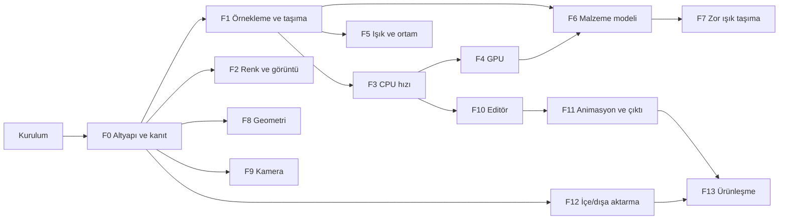

# PhotonEngine yol haritası: KeyShot ötesi

Hedef: ürün görselleştirmede KeyShot'tan daha doğru görüntü, en az onun kadar hızlı etkileşim, daha geniş malzeme ve ışık seti, eksiksiz CAD iş akışı. Karşılaştırma ölçütü KeyShot'a ek olarak V-Ray, Arnold, Cycles ve Mitsuba 3 (doğruluk referansı).

Her madde: **ne yapılır**, nerede, nasıl doğrulanır. Her faz ayrı commit dizisi. Hiçbir madde testi olmadan kapanmaz. Her faz [bench/BASELINE.md](../bench/BASELINE.md) tablosunu günceller.

## Şu anki durum

- Testler 56/56 geçiyor, `photon_app` derleniyor. 52 dosya, +1730 −451 satır commit edilmemiş.
- Çalışan kısımlar: iki yüzlü softbox ve MIS, HDRI parlaklık CDF'si, giriş/çıkışı doğru cam ve buzlu cam, anizotropik metal, sheen, ince transmission, mesh ışıkları, mesh başına tek BVH, glTF dönüşüm ve doku, ortografik kamera, katmanlı örnekleme, HDR/EXR okuma ([src/core/image/image_io.cpp](../src/core/image/image_io.cpp)).
- Asıl eksik **kanıt**: `assets/` içinde yalnız `sample_box.gltf` var. Hiçbir render KeyShot veya bir referans motorla karşılaştırılmadı.
- Makine: **GTX 1080** (Pascal, RT çekirdeği yok). `vcpkg`, CUDA ve `nvidia-smi` PATH'te yok. OIDN manifestte ama bağlı değil.

## Kilometre taşları

- **M1 — KeyShot ile eşit görüntü:** F0, F1, F2 (ton eşleme, AOV, shadow catcher), F3 (OIDN, Embree), F6 (OpenPBR çekirdeği). Bench sahnelerinde KeyShot render'ı ile yan yana, Mitsuba 3 ile sayısal fark.
- **M2 — KeyShot ile eşit hız:** F4. GTX 1080'de bench sahnesi 1 saniyede gürültüsüz önizleme.
- **M3 — KeyShot ötesi görüntü:** F5, F6'nın geri kalanı, F7. KeyShot'ta olmayan veya zayıf olanlar: MNEE kostik, path guiding, spektral mod, nested dielectric, OpenPBR, light groups ile sonradan ışık ayarı.
- **M4 — Ürün:** F8 ile F13. Yuvarlatılmış kenar, CAD, animasyon, ağ render, scripting, kurulum.

Ölçek: bu liste bir ekip için yıllar süren iş. Sıra etkiye göre; her madde tek başına teslim edilebilir.

---

## Kurulum (kullanıcı)

- [ ] **Baz commit.** `git add -A; git commit -m "lighting, materials, BVH, import"`.
- [ ] **vcpkg.** `git clone https://github.com/microsoft/vcpkg C:\vcpkg; C:\vcpkg\bootstrap-vcpkg.bat; setx VCPKG_ROOT C:\vcpkg`. Configure: `-DCMAKE_TOOLCHAIN_FILE=C:\vcpkg\scripts\buildsystems\vcpkg.cmake`.
- [ ] **CUDA ve OptiX (F4 öncesi).** CUDA Toolkit 12.x, OptiX SDK 8 (NVIDIA geliştirici hesabı), sürücü R535 veya üstü.
- [ ] **Python 3.11.** Bench karşılaştırması ve Mitsuba 3 referansı için: `pip install mitsuba flip-evaluator numpy imageio`.
- [ ] **KeyShot referansı (isteğe bağlı ama M1 için gerekli).** Bench sahnelerini aynı kamera, HDRI ve çözünürlükte KeyShot'ta render edip `bench/keyshot/` altına koy.
- [ ] **Uzak depo ve CI.** Repoyu GitHub'a (veya Origin'e) koy; F0'daki CI orada çalışır.

---

## F0 — Altyapı ve kanıt

Amaç: her sonraki değişikliği sayı ve görüntüyle ölçmek. Bu faz olmadan "daha iyi" iddiası yapılamaz.

- [ ] **Varlıklar: HDRI.** `bench/hdri/`: Poly Haven CC0 stüdyo (`studio_small_09`), dış mekân (`kloofendal_48d_partly_cloudy`), iç mekân (`brown_photostudio_02`), 2K ve 4K `.hdr`.
- [ ] **Varlıklar: modeller.** `bench/models/`: Khronos glTF örnekleri `ToyCar`, `MaterialsVariantsShoe`, `DamagedHelmet`, `GlassVaseFlowers`, `SheenChair`, `IridescenceLamp`, `TransmissionTest`, `ClearCoatTest`, `DragonAttenuation`. `bench/LICENSES.md`.
- [ ] **Bench sahneleri.** `bench/scenes/` altında `saveProject` biçiminde 10 proje: krom küre + softbox; cam şişe + kostik zemin; sıvılı şişe; plastik ürün + zemin; kumaş sandalye; araba boyalı oyuncak araba; altın yüzük + pırlanta; mat siyah elektronik ürün; iç mekân; 1M üçgenli yoğun sahne. Kamera, ışık, çözünürlük sabit.
- [ ] **Sahne yükleme motora.** `Application::applyProjectFile` içindeki pencere gerektirmeyen kısım `photon_engine` tarafında `loadProject(path) -> SceneGraph + Camera + RenderSettings` olarak; uygulama ve CLI aynı fonksiyonu çağırır. Test: kaydet → yükle → kaydet aynı JSON.
- [ ] **CLI argümanları.** [src/main.cpp](../src/main.cpp): `--scene --spp --time --res WxH --out --seed --threads --denoise`. Varsayılan derlemede açık (`PHOTON_BUILD_CLI=ON`).
- [ ] **CLI istatistikleri.** PNG + EXR + `stats.json`: süre, SPP, ışın/saniye, bellek tepe değeri, ortalama piksel varyansı.
- [ ] **Bench betiği.** `bench/run.ps1`: tüm sahneler `bench/out/<tarih>/` altına; önceki çalıştırmayla süre ve varyans farkı.
- [ ] **Görüntü karşılaştırma.** `bench/compare.py`: relMSE, SSIM, NVIDIA FLIP; fark ısı haritası PNG.
- [ ] **Mitsuba 3 referansı.** `bench/mitsuba/` aynı sahnelerin Mitsuba XML karşılığı (yalnız ortak malzemeler: difüz, iletken, dielektrik, pürüzlü dielektrik), 16384 SPP. Bizim render ile relMSE eşiği.
- [ ] **Görüntü regresyon testleri.** 128×128, 256 SPP, sabit seed; `tests/golden/` altındaki görüntüyle relMSE eşiği. Bir malzeme veya integratör değişikliği bunu bozarsa görülür.
- [ ] **Beyaz fırın: Lambertian.** `tests/test_furnace.cpp`, düzgün beyaz ortam, beyaz Lambertian yaklaşık 1 (1% tolerans).
- [ ] **Beyaz fırın: Disney.** Metal ve dielektrik, pürüzlülük 0 ile 1; 1'i aşmasın. Pürüzlü metal kaybı kaydedilir (F1 Kulla-Conty için).
- [ ] **Beyaz fırın: cam.** Dielectric ve buzlu cam, yansıma + iletim yaklaşık 1.
- [ ] **Chi-kare BSDF testi.** Her BSDF için `sample` histogramı ile `pdf` integralinin chi-kare testi (Mitsuba yöntemi). `sample` ile `pdf` tutarsızsa MIS sessizce yanlış olur; bu testsiz hiçbir yeni lob eklenmez.
- [ ] **Karşılıklılık ve pozitiflik testi.** Her BSDF için `eval(wo, wi) == eval(wi, wo)` (iletim hariç, eta düzeltmesiyle), `eval >= 0`, `pdf >= 0`.
- [ ] **Referans render'lar.** Her bench sahnesi 4096 SPP; `bench/BASELINE.md`: süre, ışın/saniye, 64 SPP varyansı, Mitsuba relMSE.
- [ ] **Günlük sistemi.** Seviyeli günlük (hata, uyarı, bilgi, ayrıntı), dosyaya ve UI konsoluna. `std::cout` çağrıları buna taşınır.
- [ ] **CI.** Windows derleme + `photon_tests` + görüntü regresyonu her push'ta. Bench yalnız gece.
- [ ] **Hata ayıklama derlemesi.** MSVC AddressSanitizer ile testler; bellek hataları CI'da yakalanır.

## F1 — Örnekleme ve ışık taşıma çekirdeği

Amaç: aynı SPP'de daha az gürültü, enerji kaybı olmadan.

- [ ] **Owen karıştırmalı Sobol.** [src/samplers/](../src/samplers/) altında Burley 2020 "Practical Hash-based Owen Scrambling". Üretim örnekleyicisi olur; `StratifiedSampler` yedek.
- [ ] **Mavi gürültü dağılımı.** Piksel başına seed karıştırma (Heitz-Belcour); düşük SPP'de gürültü beyaz değil mavi, denoise daha iyi çalışır.
- [ ] **Örnekleyici yakınsama testi.** Bilinen integral (ör. aydınlatılmış difüz düzlem) eşit SPP'de Sobol hatası Independent'tan düşük.
- [ ] **Kulla-Conty enerji telafisi.** GGX çoklu saçılma için önceden hesaplanmış `E(mu, roughness)` ve `E_avg` tabloları; metal ve dielektrik lobuna telafi terimi. Pürüzlü krom kararmaz.
- [ ] **Telafi sonrası fırın testi.** Beyaz pürüzlü metal her pürüzlülükte yaklaşık 1.
- [ ] **Işık ağacı.** Işıklar üzerinde güç ve yön konisine göre BVH (Conty-Kulla 2018); NEE rastgele ışık seçimi yerine ağaçtan. Yüzlerce ışıklı sahnede gürültü düşer.
- [ ] **Işık seçimi testi.** İki ışıktan güçlü olan güç oranında seçilir; ağaç pdf'i ile seçilen ışık tutarlı.
- [ ] **Küresel dikdörtgen örnekleme.** Dikdörtgen alan ışığı için katı açı örnekleme (Ureña 2013). Yakın softbox gürültüsü düşer.
- [ ] **Küresel üçgen örnekleme.** Mesh ışıkları için katı açı üçgen örnekleme (Arvo).
- [ ] **Işın diferansiyelleri.** Kameradan ve speküler sekmelerden; doku filtreleme ve bump için.
- [ ] **Mipmap ve doku filtreleme.** Dokular için mip zinciri, diferansiyelden trilinear veya EWA. Uzaktaki etiket ve kumaş aliasing yapmaz.
- [ ] **Sağlam kendinden kesişim önleme.** Sabit epsilon yerine Wächter-Binder (Ray Tracing Gems ch.6) ofseti; büyük ve küçük ölçekli sahnelerde gölge akne ve ışık sızıntısı yok.
- [ ] **Lob başına sekme sınırları.** Difüz, parlak, iletim, hacim için ayrı maksimum derinlik (Cycles gibi). Cam ve sıvıda varsayılan yüksek.
- [ ] **Rus ruleti.** Throughput'un en büyük bileşenine göre, minimum derinlik ayarlanabilir; enerji testleri değişmez.
- [ ] **Adaptif örnekleme.** [src/engine/renderer.cpp](../src/engine/renderer.cpp) karo başına ikinci moment; göreli hata eşiği altındaki karo durur, minimum 16 SPP, UI'de eşik.
- [ ] **Adaptif örnekleme testi.** Düz renkli karo erken durur, gürültülü karo devam eder; sonuç ortalaması değişmez.
- [ ] **Firefly kelepçesi.** Dolaylı katkıya kapatılabilir kelepçe, varsayılan kapalı.
- [ ] **Path regularization.** Difüzden sonraki çok düzgün yüzeyi biraz pürüzlü say; kapatılabilir, kostik modunda kapalı.

## F2 — Renk ve görüntü pipeline'ı

Amaç: ürün rengini ekrana ve dosyaya doğru taşımak; KeyShot'un "Image" sekmesinin tamamı ve ötesi.

- [ ] **Çalışma renk uzayı.** Doğrusal Rec.709 (varsayılan) veya ACEScg seçimi; tüm malzeme ve ışık renkleri seçili uzaya bir kez dönüştürülür.
- [ ] **OpenColorIO.** vcpkg `opencolorio`; görüntüleme dönüşümleri sRGB, Display P3, Rec.2020. Viewport monitör profiline göre.
- [ ] **Doku renk uzayı.** Renk dokuları sRGB'den doğrusala, normal/roughness/metallic dokuları ham. glTF ve preset yolunda doğrulanır. Test: sRGB 0.5 dokusu doğrusal 0.214 okunur.
- [ ] **PBR Neutral.** [src/core/image/tone_mapping.cpp](../src/core/image/tone_mapping.cpp) `ToneMapOperator` enum'una; UI seçeneği. Ürün rengi olduğu gibi kalır.
- [ ] **AgX.** Doymuş ışıkta renk kayması yok.
- [ ] **Ton eşleme testleri.** Orta gri ve beyaz noktası her operatörde beklenen değerde; viewport ve dışa aktarma aynı sonucu verir.
- [ ] **Fiziksel pozlama.** EV, ya da F9'daki f-stop + enstantane + ISO'dan hesaplanan pozlama.
- [ ] **Beyaz dengesi.** Kelvin ve renk tonu; Bradford dönüşümü.
- [ ] **Bloom ve glare.** HDR üzerinde çok ölçekli Gauss bloom ve yıldız glare (diyafram bıçağı sayısıyla).
- [ ] **Vinyet ve renk sapması.** Post işlem olarak, ayarlanabilir.
- [ ] **Eğriler, kontrast, doygunluk, LUT.** `.cube` LUT okuma; tüm post işlemler yıkıcı değil, birikim tamponu değişmez.
- [ ] **AOV'ler.** Albedo, normal, derinlik, konum, nesne ID, malzeme ID, UV, gölge, AO.
- [ ] **Işık yolu geçişleri.** Doğrudan/dolaylı × difüz/parlak/iletim/hacim/emisyon ayrı tamponlar; toplamı güzellik geçişine eşit (test).
- [ ] **Işık grupları.** Işık veya ışık grubu başına ayrı tampon; render bittikten sonra her grubun parlaklığı ve rengi yeniden render etmeden değişir. KeyShot'ta bu yok.
- [ ] **Cryptomatte.** Nesne ve malzeme Cryptomatte katmanları EXR'de; Nuke ve Fusion ile uyumlu.
- [ ] **Shadow catcher.** [src/scene/scene_graph.cpp](../src/scene/scene_graph.cpp) zemini `shadowCatcher` bayrağı; gölge ve yansıma yakalanır, arka plan görünür.
- [ ] **Alfa.** Premultiplied alfa; arka plansız ürün + zemin gölgesi.
- [ ] **Çok katmanlı EXR.** Tüm AOV, ışık grubu ve Cryptomatte tek dosyada (tinyexr katman desteği).
- [ ] **16 bit PNG ve TIFF, ICC profili.** Display P3 ve Adobe RGB çıktısında gömülü ICC.

## F3 — CPU performansı

- [ ] **OIDN.** vcpkg ile [CMakeLists.txt](../CMakeLists.txt) `find_package(OpenImageDenoise)`, `PHOTON_OIDN_FOUND`. [src/engine/denoiser.cpp](../src/engine/denoiser.cpp) albedo ve normal ile.
- [ ] **OIDN ön filtreleme.** Albedo ve normal ayrıca denoise edilir (`cleanAux`); ince dokularda detay korunur.
- [ ] **OIDN canlı önizleme.** `denoiseCopy` ayrı iş parçacığında; birikim bozulmaz.
- [ ] **Embree 4.** `vcpkg.json` içine `embree`, `PHOTON_USE_EMBREE`. Mesh başına `rtcNewGeometry(RTC_GEOMETRY_TYPE_TRIANGLE)`. [src/geometry/bvh.cpp](../src/geometry/bvh.cpp) yedek ve test referansı; aynı ışınlarda `t` ve normal eşit.
- [ ] **Embree ölçümü.** Bench'te eski BVH ile karşılaştırma; tutmazsa bayrak kapalı.
- [ ] **Örnekleme (instancing).** Embree instance ve `SceneGraph` örnek düğümü; aynı mesh tek kopya bellekte. 1000 vida bir vida kadar bellek.
- [ ] **İş çalan iş parçacığı havuzu.** Karo zamanlayıcısı atomik sayaç ve iş çalma; UI iş parçacığı render beklemez.
- [ ] **Karo sırası.** Ortadan dışa spiral; kullanıcı ürünü önce görür.
- [ ] **Önizleme kademeleri.** Kamera hareket ederken 1/4 çözünürlük ve 1 SPP, durunca tam çözünürlük.
- [ ] **Artımlı sahne güncellemesi.** Malzeme parametresi değişince BVH yeniden kurulmaz; dönüşüm değişince yalnız üst seviye yeniden kurulur. Test: malzeme değişikliği sonrası ilk karenin süresi.
- [ ] **Doku önbelleği.** Döşemeli mipmap dokular, bellek bütçesi, LRU; 8K doku setleri belleği taşırmaz.
- [ ] **Sıcak yolda ayırma yok.** Profil ile kesişim ve gölgelemede `shared_ptr` kopyası ve heap ayırması sıfırlanır.
- [ ] **Profil.** VS profiler ile her bench sahnesinde ilk 3 sıcak nokta; ölçülen, tahmin edilen değil.
- [ ] **Mesh sıkıştırma.** İsteğe bağlı oktahedral normal ve 16 bit UV; büyük CAD montajlarında bellek yarıya iner.
- [ ] **Performans regresyon eşiği.** Gece bench'inde ışın/saniye %5'ten fazla düşerse CI uyarır.

## F4 — GPU (GTX 1080, CUDA/OptiX)

- [ ] **`PHOTON_HD` makrosu.** CUDA'da `__host__ __device__`, CPU'da boş; [src/core/math/](../src/core/math/), `Color3f`, örnekleyiciler, Fresnel.
- [ ] **Paylaşılan malzeme çekirdeği.** [src/materials/](../src/materials/) `eval`/`sample`/`pdf` düz `MaterialParams` üzerinde, sanal çağrısız; CPU sınıfları bunu çağırır. İki kopya yok.
- [ ] **Paylaşılan ışık örnekleme.** Işık ağacı, ortam CDF'si, küresel dikdörtgen örnekleme aynı kod.
- [ ] **CMake.** `PHOTON_BUILD_GPU=ON`: `enable_language(CUDA)`, `OptiX_INSTALL_DIR`; bulunamazsa uyarı, kırılma yok.
- [ ] **Sahne yükleme.** `SceneGraph::compile` çıktısı düz tamponlara: vertex, index, malzeme, ışık, ortam ve CDF, dokular.
- [ ] **Artımlı GPU güncellemesi.** Malzeme parametresi tampon güncellemesi; dönüşüm IAS güncellemesi; tam yükleme yok.
- [ ] **OptiX programları.** `src/gpu/`: raygen, closest-hit, miss, gölge any-hit; GAS mesh başına, IAS örnekler için.
- [ ] **GPU path tracer.** CPU ile aynı NEE, MIS, Rus ruleti ve Sobol dizisi.
- [ ] **GPU dokuları.** Mipmap'li CUDA texture objeleri, sRGB çözme donanımda.
- [ ] **GPU denoise.** OptiX denoiser; Pascal desteği doğrulanacak, yoksa OIDN CPU kopyada.
- [ ] **Viewport.** CUDA-GL interop ile doğrudan dokuya; [src/preview/gl_preview.cpp](../src/preview/gl_preview.cpp) GPU yoksa yedek.
- [ ] **CPU-GPU eşleşme testi.** Bench sahnelerinde eşit SPP'de ortalama fark gürültü standart sapmasının altında. Bu geçmeden GPU varsayılan olmaz.
- [ ] **GPU bench.** Işın/saniye, ilk temiz kareye süre, bellek; `BASELINE.md`.
- [ ] **Wavefront integratör.** Megakernel ölçüldükten sonra, malzeme dallanması darboğazsa, ışın sıralı wavefront.
- [ ] **Hibrit render.** Son render'da CPU ve GPU aynı anda farklı karolarda.
- [ ] **Çoklu GPU.** Karo veya kare bölüşümü; ikinci kart takılırsa.
- [ ] **ReSTIR DI (isteğe bağlı).** Etkileşimli viewport'ta çok ışıklı sahneler için; yanlı olduğu için son render'da kapalı.

Ceiling: Pascal'da RT çekirdeği yok. Kart değişirse aynı kod donanım kesişimiyle çalışır.

## F5 — Işık ve ortam

- [ ] **Spot ışık.** Koni açısı, yumuşak kenar, [src/lights/point_light.cpp](../src/lights/point_light.cpp) yanında.
- [ ] **Disk, küre ve silindir alan ışıkları.** KeyShot'un ışık şekilleri; her biri için katı açı örnekleme.
- [ ] **Dokulu alan ışığı.** Softbox gradyanı, şerit ışık deseni; dokuya göre önem örneklemesi.
- [ ] **Portal ışıklar.** İç mekânda pencereden giren HDRI için; gürültü düşer.
- [ ] **Fiziksel güneş ve gökyüzü.** Hosek-Wilkie veya Nishita; konum, tarih, saat; güneş diski ve atmosfer.
- [ ] **HDRI düzenleyici: pinler.** HDRI üzerine parlak dikdörtgen veya daire "pin"; konum, boyut, yumuşaklık, renk; CDF yeniden kurulur. KeyShot'un imza özelliği.
- [ ] **HDRI düzenleyici: ayarlar.** Parlaklık, kontrast, ton, doygunluk, gama, bulanıklık; çok katmanlı (HDRI + pinler + gradyan).
- [ ] **HDRI düzenleyici: viewport'ta tıkla-yerleştir.** Üründe tıklanan noktada vurgu oluşacak şekilde pin yönü hesaplanır.
- [ ] **HDRI düzenleyici testi.** Pin eklenen yönde parlaklık artar, CDF integrali 1, örnekler pine yoğunlaşır.
- [ ] **Ayrık arka plan, yansıma ve aydınlatma.** Aydınlatma HDRI'si, kamera arka planı ve yansıma HDRI'si ayrı ayrı seçilebilir.
- [ ] **Zemine yansıtılmış HDRI kubbesi.** Zemin yarıçapı ve kamera yüksekliği; ürün HDRI ortamında gerçekten zeminde durur.
- [ ] **Işık bağlama.** Işık başına dahil ve hariç nesne listesi.
- [ ] **Gölge bağlama.** Nesne başına hangi ışığın gölgesini bırakacağı.
- [ ] **IES profilleri.** LM-63 okuyucu, nokta, spot ve alan ışığına bağlanır.
- [ ] **Emisyon dokuları.** Ekran, LED gösterge, logo; mesh ışığı dokuya göre önem örneklemesi.
- [ ] **Görünürlük bayrakları.** Işık başına kamera, yansıma, gölge görünürlüğü.
- [ ] **Aydınlatma ön ayarları.** "Performans", "Ürün", "İç mekân", "Mücevher": sekme sayıları, kostik, guiding ayarlarını tek seçimle değiştirir.

## F6 — Malzeme modeli

Amaç: tek, standart, enerji koruyan bir yüzey modeli ve onun üstünde ürün malzemeleri.

**Çekirdek**
- [ ] **OpenPBR Surface.** ASWF standardı; lob'lar: taban (difüz, metal), anizotropik speküler, kaplama (kararmayla), fuzz, ince film, iletim, yüzey altı, emisyon. [src/materials/disney.cpp](../src/materials/disney.cpp) yanında `openpbr.cpp`.
- [ ] **Disney'den OpenPBR'a geçiş.** Mevcut presetler eşlenir, eski proje dosyaları yüklenir; Disney test referansı olarak kalır.
- [ ] **Lob başına chi-kare testi.** Her OpenPBR lobu için F0 testi.
- [ ] **Lob başına fırın testi.** Her lob ve tam malzeme 1'i aşmaz.
- [ ] **Karışım malzemesi.** İki malzeme arasında doku maskesiyle karışım.
- [ ] **Çok katmanlı malzeme.** Taban + birden çok kaplama (boya üstü vernik üstü toz); position-free Monte Carlo katmanlama (Guo 2018) veya OpenPBR kaplama yığını.

**İletkenler**
- [ ] **Karmaşık IOR (n, k).** Altın, gümüş, bakır, alüminyum, krom, titanyum, nikel için ölçülmüş spektral veri RGB'ye; presetler.
- [ ] **Sanatsal iletken Fresnel.** Gulbrandsen eşlemesi: yansıma rengi + kenar rengi.

**Dielektrikler ve sıvılar**
- [ ] **İç içe dielektrikler.** Öncelik sistemi (Schmidt-Budge); şişe içindeki sıvıda cam-sıvı arayüzünün IOR oranı doğru. Parfüm ve içecek şişeleri için.
- [ ] **İnce duvarlı cam.** Kırılma ofseti olmadan; pencere ve ince ambalaj.
- [ ] **Hacimsel soğurma.** Beer-Lambert, renkli cam ve sıvı; kalınlığa göre renk.
- [ ] **Dispersiyon.** Hero wavelength, Cauchy veya Sellmeier, Abbe sayısı; CIE ağırlıklı RGB.
- [ ] **Dispersiyon testi.** Kırmızı ve mavi farklı açıda kırılır; beyaz ortamda ortalama renk korunur.
- [ ] **Mücevher.** Yüksek IOR, dispersiyon, TIR; pırlanta, yakut, safir presetleri.

**Yüzey altı ve hacim**
- [ ] **Homojen ortam.** `sigma_a`, `sigma_s`, Henyey-Greenstein `g`; kapalı mesh'e bağlı.
- [ ] **Random-walk SSS.** Ortam içinde mesafe örnekleme, saçılma veya sınır; sınırda Fresnel. Absorbsiyonsuz ortam fırında enerjiyi korur.
- [ ] **SSS presetleri.** Yeşim, sabun, süt, mum, cilt, mermer, buzlu plastik.

**Ürün malzemeleri**
- [ ] **İnce film girişimi.** Belcour-Barla; sabun köpüğü, kaplamalı lens, anodize metal, böcek kanadı.
- [ ] **Araba boyası.** Kaplama altında prosedürel pul katmanı; pul normali hücre gürültüsünden, yoğunluk, boyut, renk, flip-flop renk.
- [ ] **Karbon fiber.** Dokuma deseninden anizotropi yönü + kaplama.
- [ ] **Kumaş.** Charlie sheen ve dokuma desenleri (düz, dimi, saten); kadife ve süet.
- [ ] **Kauçuk ve yumuşak plastik.** Hafif SSS + yüksek pürüzlülük presetleri.

**Dokular ve eşleme**
- [ ] **Doku kanalları.** Taban rengi, normal, pürüzlülük, metal, AO, emisyon, opaklık, kaplama.
- [ ] **Bump.** Yükseklik dokusundan, ışın diferansiyelleriyle.
- [ ] **Triplanar eşleme.** UV'siz CAD modelleri için; KeyShot'un varsayılan yolu.
- [ ] **Projeksiyonlar.** Düzlem, kutu, silindir, küre; viewport'ta sürüklenebilir.
- [ ] **Etiketler.** Nesne başına birden çok etiket, projeksiyon, katman sırası, alfa, kendi malzemesi (parlak etiket mat ürün üstünde). KeyShot'un imza özelliği.
- [ ] **Prosedürel dokular.** Gürültü, hücre, ahşap, mermer, çizik, parmak izi, fırçalı, delikli metal, deri, granit, beton.
- [ ] **Renk girişi.** RGB, HSV, Lab, RAL; ölçülmüş renk girilebilir.

**Kütüphane ve standartlar**
- [ ] **Malzeme grafiği.** Düğüm düzenleyici (vcpkg `imnodes`); dokular, matematik, karışım düğümleri OpenPBR girişlerine.
- [ ] **MaterialX içe aktarma.** OpenPBR ve Standard Surface MaterialX belgeleri.
- [ ] **MDL içe aktarma (isteğe bağlı).** NVIDIA MDL SDK (BSD-3); vMaterials kütüphanesine erişim.
- [ ] **AxF ölçülmüş malzemeler (lisansa bağlı).** X-Rite AxF SDK sözleşmesi gerekir.
- [ ] **Kütüphane genişletme.** 300+ preset: metal, plastik, cam, sıvı, kumaş, deri, ahşap, taş, boya, mücevher, ışık; kategori ve arama.
- [ ] **Path traced küçük resimler.** Blinn-Phong yerine küçük küre sahnesinde render, disk önbelleği.

## F7 — Zor ışık taşıma

Amaç: KeyShot'un zayıf olduğu kostik ve karmaşık cam sahnelerinde öne geçmek.

- [ ] **Path guiding.** Open PGL (vcpkg `openpgl`); BSDF ile karışım örnekleme, kapatılabilir.
- [ ] **Guiding ölçümü.** Cam altı kostik ve iç mekân sahnesinde eşit süre açık/kapalı varyans.
- [ ] **MNEE.** Manifold Next Event Estimation (Hanika 2015, Zeltner 2020); cam ve sıvı arkasındaki difüz yüzeye ışığın kırılarak gelmesi. Parfüm şişesi gölgesindeki kostik.
- [ ] **MNEE testi.** Basit cam küre altında kostik parlaklığı referans BDPT ile eşleşir.
- [ ] **Gölge terminatörü düzeltmesi.** Düşük poligonlu CAD tessellation'ında gölge sınırı tırtıklanmaz (Chiang 2019 veya Hanika 2021).
- [ ] **BDPT referans modu.** Çift yönlü path tracer; yalnız doğrulama ve zor sahneler için.
- [ ] **VCM (isteğe bağlı).** Vertex connection and merging; kostik ağırlıklı sahneler için.
- [ ] **Spektral mod.** Hero wavelength (4 dalga boyu), Jakob-Hanika spektral yukarı örnekleme; RGB varsayılan kalır.
- [ ] **Spektral ve RGB karşılaştırması.** Beyaz ortamda gri malzemeler iki modda eşleşir.
- [ ] **Global sis ve ışık huzmeleri.** Homojen sahne ortamı, spot ışıkta hacimsel huzme.
- [ ] **Heterojen hacimler.** OpenVDB (vcpkg `openvdb`), duman ve buhar; delta tracking.

## F8 — Geometri

- [ ] **Yuvarlatılmış kenarlar.** Gölgelemede yakın geometriyi arayarak normal yumuşatma (Cycles bevel yöntemi); CAD'in keskin kenarları gerçek ürün gibi parlar. KeyShot'un "Round Edges" karşılığı.
- [ ] **Yuvarlatılmış kenar testi.** Küp kenarında normal yarıçap içinde sürekli değişir.
- [ ] **Alt bölümleme yüzeyleri.** OpenSubdiv (vcpkg `opensubdiv`); Catmull-Clark.
- [ ] **Yer değiştirme (displacement).** Skaler ve vektör; mikropoligon tessellation.
- [ ] **Uyarlamalı tessellation.** Ekran boyutuna göre.
- [ ] **Eğriler ve saç.** Embree eğri primitifi; fırça, halı, kürk.
- [ ] **Saçma (scatter).** Yüzeye örnek dağıtma; çakıl, toz, kum.
- [ ] **Açıya göre otomatik yumuşatma.** CAD içe aktarmada sert kenar eşiği.
- [ ] **Ters normal onarımı.** Kapalı yüzeyde dış yön tespiti ve düzeltme.
- [ ] **Geometri temizliği.** Köşe kaynaklama, dejenere üçgen silme, T-kavşak uyarısı.
- [ ] **Kesit (cutaway).** Kesit düzlemi ve kesit malzemesi; montajın içini gösterme.
- [ ] **Zemin seçenekleri.** Sonsuz zemin, yalnız gölge, yalnız yansıma, zemin ızgarası.
- [ ] **Büyük sahne bench'i.** 100M üçgen (örneklemeyle) yüklenir, gezinilir, render edilir.

## F9 — Kamera

- [ ] **Fiziksel kamera.** f-stop, enstantane, ISO; pozlama F2 ile bağlı.
- [ ] **Odak uzaklığı ve sensör.** mm ve sensör ön ayarları (tam kare, APS-C, orta format).
- [ ] **Tıkla-odakla.** Viewport'ta nesneye tıklayınca odak mesafesi.
- [ ] **Bokeh şekli.** Diyafram bıçağı sayısı, dönüş, anamorfik oran, özel bokeh görüntüsü.
- [ ] **Lens bozulması.** Brown-Conrady; kamera eşlemede ters dönüşüm.
- [ ] **Tilt-shift ve perspektif düzeltme.** Dikey çizgiler düz kalır.
- [ ] **Panorama.** Eşdikdörtgen 360 ve küp harita.
- [ ] **Stereo VR.** Omni-directional stereo.
- [ ] **Kamera eşleme.** Arka plan fotoğrafı, iki kaybolma noktası ile kamera çözme.
- [ ] **Çoklu kamera.** Kayıtlı kameralar, liste, hızlı geçiş.
- [ ] **Kırpma düzlemleri.** Yakın ve uzak kırpma, kamera kesiti.
- [ ] **Lens renk sapması.** Fiziksel olarak ışın üretiminde, isteğe bağlı.

## F10 — Editör ve iş akışı

- [ ] **Gizmo.** Taşı, döndür, ölçekle (vcpkg `imguizmo`); yerel ve dünya ekseni.
- [ ] **Geri al / yinele.** Komut yığını; her sahne değişikliği komut.
- [ ] **Sahne ağacı.** Sürükle-yeniden ebeveynle, çoklu seçim, grup, görünürlük, kilit.
- [ ] **Zemine bırak, hizala, ortala.** Tek tıkla.
- [ ] **Canlı malzeme düzenleme.** Parametre değişince render sıfırlanır ama sahne yeniden derlenmez.
- [ ] **Malzeme düzenleyici paneli.** Tüm OpenPBR parametreleri, doku yuvaları, önizleme küresi.
- [ ] **Malzeme kopyala, yapıştır, bağla.** Aynı malzemeyi birden çok parçaya bağlı atama.
- [ ] **Damlalık.** Viewport'tan malzeme alma.
- [ ] **HDRI kütüphanesi tarayıcısı.** Küçük resimler, sürükle-bırak.
- [ ] **Stüdyolar.** Kamera + ortam + aydınlatma + malzeme varyantı kayıtlı kombinasyonları (KeyShot Studios).
- [ ] **Varyantlar ve yapılandırıcı.** Malzeme varyantları ve görünürlük setleri; glTF `KHR_materials_variants`.
- [ ] **Render kuyruğu.** Stüdyolardan toplu iş, arka planda.
- [ ] **Bölge render.** Viewport'ta dikdörtgen seçip yalnız orayı render etme.
- [ ] **Çıktı paneli.** Çözünürlük ön ayarları, baskı DPI, süre veya SPP sınırı, dosya adı şablonu.
- [ ] **Viewport katmanları.** Izgara, güvenli çerçeve, üçler kuralı, render bölgesi.
- [ ] **Performans ve kalite modu.** Viewport'ta tek tuşla.
- [ ] **Tercihler.** Birimler, tema, kısayollar.
- [ ] **Yerelleştirme.** Türkçe ve İngilizce arayüz.
- [ ] **Otomatik kaydetme ve çökme kurtarma.**
- [ ] **Proje biçimi sürümleme.** Eski projeler yeni sürümde açılır; geçiş testleri.
- [ ] **Paketlenmiş proje.** `.photon` arşivi: model, doku, HDRI tek dosyada.
- [ ] **Son dosyalar ve başlangıç ekranı.**

## F11 — Animasyon ve çıktı

- [ ] **Anahtar kare sistemi.** Dönüşüm, kamera, malzeme parametresi, ışık.
- [ ] **Tek tık döner tabla (turntable).**
- [ ] **Kamera yolu animasyonu.**
- [ ] **Patlatılmış görünüm animasyonu.** Montaj parçalarını eksen boyunca ayırma.
- [ ] **Zaman çizelgesi arayüzü.**
- [ ] **Hareket bulanıklığı.** Enstantane aralığı, dönüşüm enterpolasyonu, Embree hareket BVH.
- [ ] **Görüntü dizisi çıktısı.**
- [ ] **Video dışa aktarma.** vcpkg `ffmpeg`; MP4 H.264 ve H.265.
- [ ] **Zamansal kararlılık.** Kareler arası sabit seed deseni; animasyonda titreşmeyen denoise.
- [ ] **Bellekten büyük çözünürlük.** 16K ve üstü döşemeli render, döşemeler diske.
- [ ] **Ağ render.** TCP üzerinden çalışan süreçler; karo ve kare dağıtımı, sonuç birleştirme.
- [ ] **Render çiftliği komut satırı.** CLI kare aralığı ve döşeme parametreleri.

## F12 — İçe ve dışa aktarma

- [ ] **Assimp.** vcpkg `assimp`; FBX, DAE, 3DS, PLY. Mevcut [src/io/obj_loader.cpp](../src/io/obj_loader.cpp) ve [src/io/gltf_loader.cpp](../src/io/gltf_loader.cpp) kalır. `Application::importModel` FBX reddi kalkar.
- [ ] **OpenCASCADE.** vcpkg `opencascade`; `STEPCAFControl_Reader`, `IGESCAFControl_Reader`, `BRepMesh_IncrementalMesh`.
- [ ] **STEP montaj ağacı.** Montaj `SceneGraph` düğümlerine.
- [ ] **STEP renk ve adları.** Parça adları ve renkleri malzemeye.
- [ ] **İçe aktarma diyaloğu.** Tessellation kalitesi (sapma, açı), birim (mm, cm, m, inç), yukarı ekseni.
- [ ] **OpenUSD içe aktarma.** vcpkg `usd`; `UsdPreviewSurface` ve MaterialX malzemeleri.
- [ ] **USD dışa aktarma.**
- [ ] **glTF uzantıları.** `KHR_materials_transmission`, `volume`, `clearcoat`, `sheen`, `iridescence`, `specular`, `ior`, `emissive_strength`, `variants`, `KHR_texture_transform`.
- [ ] **glTF dışa aktarma.**
- [ ] **Alembic.** Animasyon önbellekleri.
- [ ] **3MF ve STL.**
- [ ] **Malzemeyi koruyarak yeniden içe aktarma.** CAD dosyası değişince parça adına göre eşleşme, malzemeler korunur (KeyShot LiveLinking karşılığı).
- [ ] **Blender köprüsü (isteğe bağlı).** Blender eklentisi sahneyi USD olarak gönderir.
- [ ] **İçe aktarma testleri.** STEP, IGES, FBX, USD fixture'ları: parça sayısı, sınır kutusu, birim, malzeme sayısı.

## F13 — Ürünleşme

- [ ] **Python betikleri.** pybind11 (vcpkg `pybind11`); sahne, malzeme, kamera, render API'si.
- [ ] **Eklenti API'si.** C ABI ile içe aktarıcı ve malzeme eklentileri.
- [ ] **Kurulum paketi.** WiX veya NSIS, çalışma zamanı kütüphaneleri.
- [ ] **Çökme raporlayıcı.** Minidump ve günlük dosyası.
- [ ] **Yerel performans günlüğü.** Telemetri yok; render istatistikleri yerelde.
- [ ] **Kullanıcı belgeleri.** Başlangıç, malzemeler, ışık, render, CAD.
- [ ] **API belgeleri.** Python ve eklenti API'si.
- [ ] **Örnek içerik paketi.** Bench sahneleri, HDRI'ler, malzemeler.
- [ ] **Kod imzalama.**
- [ ] **Güncelleme kontrolü.**
- [ ] **Gece derlemeleri.** CI kurulum paketini üretir.
- [ ] **Lisans denetimi.** OCCT (LGPL), Assimp (BSD), Embree (Apache), OIDN (Apache), Open PGL (Apache), OpenSubdiv, USD, ffmpeg (LGPL); dağıtım koşulları.

---

## Bilerek dışarıda

- **SolidWorks, Creo, NX, CATIA yerel biçimleri.** Ticari SDK lisansı gerekir; STEP ve IGES bu ihtiyacın çoğunu karşılar.
- **Pantone renk kütüphanesi.** Lisanslı; Lab ve RAL girişi yeterli.
- **Bulut render hizmeti.** Ağ render (F11) yerel çiftliği kapsar.
- **Vulkan backend.** Makine NVIDIA; OptiX yeterli. AMD kullanıcıları için F4 sonrası yeniden değerlendirilir.
